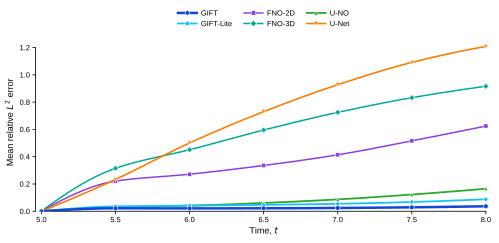
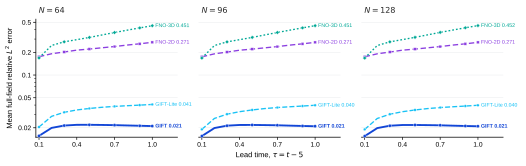
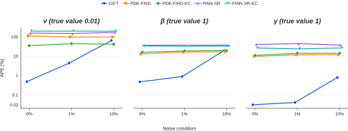
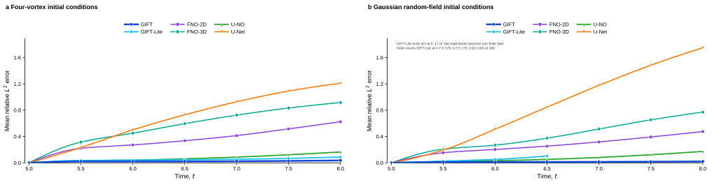

# GIFT 数值实验记录

本记录 GIFT 在二维不可压缩流动状态建模中的七项数值实验。三项主线实验研究递归预测、跨分辨率预测和方程参数识别，四项支线实验研究高频支路、递归局部修正、训练随机种子和初值分布的影响。GIFT 由冻结生成元、高频支路和递归局部修正组成。

预测实验比较全数据 GIFT（1000 条训练轨迹）、GIFT-Lite（50 条训练轨迹）和相应基线。全数据 GIFT 的生成元与高频支路各训练 500 个轨迹 epoch，预算分项报告。M1 保持独立的参数识别设置。

文中每个预测时刻均单独评价。不同预测时刻的误差不合并为一个平均指标。`results/formal/` 提供已完成实验的汇总记录和 SVG；完整逐轨迹数组可由各实验命令重新生成，详见第 7 节。

## 1. 实验总表

> 实验编号在本记录（与项目代码、结果目录一致）中使用 M 系列：M1 方程参数识别、M2 递归预测、M3 跨分辨率预测。论文附加材料使用另一套按正文叙述顺序排列的 W 系列：W1 递归预测（= M2）、W2 跨分辨率预测（= M3）、W3 方程参数识别（= M1）。

| 编号 | 类别 | 实验名称 | 目的 | 比较对象 | 运行入口 | 结果目录 |
| --- | --- | --- | --- | --- | --- | --- |
| M2 | 主线实验 | 递归预测 | 评价 $N=64$、$t=5.0$ 至 $t=8.0$ 的长时间自主预测误差和数值有限性 | GIFT、GIFT-Lite、FNO-2D、FNO-3D、U-NO、U-Net | `experiments/formal/m2_recursive_prediction/run.py` | `results/formal/M2_recursive_prediction/` |
| M3 | 主线实验 | 跨分辨率预测 | 评价只用 $N=64$ 数据训练后在 $N=64$、$N=96$ 和 $N=128$ 网格上的预测能力 | GIFT、GIFT-Lite、FNO-2D、FNO-3D | `experiments/formal/m3_cross_resolution/run.py` | `results/formal/M3_cross_resolution/` |
| M1 | 主线实验 | 方程参数识别 | 比较 0%、1% 和 10% 噪声下三个方程参数的识别误差 | GIFT、PDE-FIND、PDE-FIND-KC、PINN-SR、PINN-SR-KC | `experiments/formal/m1_equation_identification/run.py` | `results/formal/M1_equation_identification/` |
| S1 | 支线实验 | 高频支路有效性 | 评价高频支路对瞬时方程右端和递归状态的整体作用 | GIFT、GIFT-Lite 及各自的高频支路关闭配置 | `experiments/formal/s1_high_frequency_branch/run.py` | `results/formal/S1_high_frequency_branch/` |
| S2 | 支线实验 | 递归局部修正有效性 | 评价递归局部修正对非有限结果和局部误差放大的抑制作用 | GIFT、GIFT-Lite 及各自的递归局部修正关闭配置 | `experiments/formal/s2_recursive_local_correction/run.py` | `results/formal/S2_recursive_local_correction/` |
| S3 | 支线实验 | 随机种子稳定性 | 评价三次独立训练得到的主要指标差异 | 随机种子 20260820、20260821、20260822 | `experiments/formal/s3_seed_stability/run.py` | `results/formal/S3_seed_stability/` |
| S4 | 支线实验 | 初值分布对照 | 在平滑高斯随机场初值分布上重复 M2 的分布内比较 | GIFT、GIFT-Lite、FNO-2D、FNO-3D、U-NO、U-Net | `experiments/formal/s4_initial_distribution/run.py` | `results/formal/S4_initial_distribution/` |

## 2. 研究对象、数据和统一设置

### 2.1 频率分解

设 $\widehat{\omega}(k_x,k_y)$ 为状态 $\omega$ 的二维 Fourier 系数。方形投影 $P_m$ 定义为

$$
\widehat{P_m \omega}(k_x,k_y)=
\begin{cases}
\widehat{\omega}(k_x,k_y), & |k_x|\le m\ \text{且}\ |k_y|\le m,\\
0, & \text{其他情况}.
\end{cases}
$$

$Q_{21}$ 是 $P_{21}$ 的补空间投影，因此

$$
Q_{21}\omega=\omega-P_{21}\omega,\qquad
\omega_K=P_{21}\omega,\qquad
\omega_Q=Q_{21}\omega,\qquad
\omega=\omega_K+\omega_Q.
$$

$\omega_K$ 是带限状态，$\omega_Q$ 是补状态；$Q_{21}$ 包含 $P_{21}$ 之外的全部可表示模态。本记录不把 $Q_{21}$ 再划分为更窄的频段来评价高频支路的作用。注意符号 $Q$ 表示生成元的二次通道，$Q_{21}$ 表示谱投影，两者互不相关，全文不混用。

### 2.2 模型训练和验证使用的数据

全数据 GIFT 与四个预测基线使用相同的 1000 条训练轨迹；保留的 GIFT-Lite 使用其中前 50 条。Lite 表示减少训练数据，不表示缩小网络。下表说明预测模型的训练和保存方式；M1 的参数识别方法在该实验开头单独说明。

| 方法 | 训练数据 | 训练期间的验证或模型保存方式 |
| --- | --- | --- |
| GIFT | 1000 条 $N=64$ 轨迹，$t=0.0$ 至 $t=10.0$，时间间隔 0.02 | 生成元和高频支路各训练 500 epoch，分别报告；使用终态权重，验证仅作监测 |
| GIFT-Lite | 50 条 $N=64$ 轨迹，$t=0.0$ 至 $t=10.0$，时间间隔 0.02 | 另用 20 条 $N=64$ 轨迹验证；冻结生成元和高频支路均不使用测试轨迹训练 |
| FNO-2D | 1000 条 $N=64$ 轨迹，$t=0.0$ 至 $t=10.0$，时间间隔 0.02，共 501 帧 | 不使用验证误差选择模型，采用第 500 轮训练结果 |
| FNO-3D | 1000 条 $N=64$ 轨迹，时间范围、采样间隔和帧数与 FNO-2D 相同 | 不使用验证误差选择模型，采用第 500 轮训练结果 |
| U-NO | 与两个 FNO 相同的 1000 条 $N=64$ 轨迹及完整时间序列 | 不使用验证误差选择模型，采用第 500 轮训练结果 |
| U-Net | 与两个 FNO 相同的 1000 条 $N=64$ 轨迹及完整时间序列 | 不使用验证误差选择模型，采用第 500 轮训练结果 |

四个同类预测基线统一训练 500 epoch，每个 epoch 将 1000 条轨迹各访问一次。全数据 GIFT 的生成元和高频支路各训练 500 个轨迹 epoch，明确记为 500+500，不称为整套模型总预算与基线相同。GIFT-Lite 保留其已完成的多阶段训练和验证选模方式，因此不是仅改变数据量的消融。相同 epoch 不等于相同参数更新次数或计算量：FNO-2D、FNO-3D、U-NO 和 U-Net 的训练预测长度分别为 150、150、20 和 4 步，批量和梯度累积方式也不同。更新次数、实际耗时及计时范围须结合 [训练协议](docs/TRAINING_PROTOCOL.md) 解读。

| 模型 / 阶段 | 训练轨迹 | 训练预算 | 参数更新次数 | 实测耗时（秒） |
| --- | ---: | --- | ---: | ---: |
| GIFT 生成元 | 1000 | 500 epoch（250+250） | 31500；另有 501 次仿射拟合 | 703.8 |
| GIFT 高频支路（种子 20260820） | 1000 | 500 epoch（400+50+25+25） | 45200 | 17376.9 |
| GIFT 高频支路（种子 20260821） | 1000 | 500 epoch（400+50+25+25） | 45200 | 7868.0 |
| GIFT 高频支路（种子 20260822） | 1000 | 500 epoch（400+50+25+25） | 45200 | 9268.4 |
| GIFT-Lite 生成元（0% 噪声） | 50 | 6000+6000 步 | 12000 | 351.3 |
| M1 生成元（0% 噪声） | 1 | 6000+6000 步 | 12000 | 102.7 |
| M1 生成元（1% 噪声） | 1 | 6000+6000 步 | 12000 | 104.0 |
| M1 生成元（10% 噪声） | 1 | 6000+6000 步 | 12000 | 103.3 |
| GIFT-Lite 高频支路（种子 20260820） | 50 | 18+2+2 阶段 epoch | 5834 | 231.3 |
| GIFT-Lite 高频支路（种子 20260821） | 50 | 18+2+2 阶段 epoch | 5834 | 261.3 |
| GIFT-Lite 高频支路（种子 20260822） | 50 | 18+2+2 阶段 epoch | 5834 | 251.1 |
| FNO-2D | 1000 | 500 epoch | 25000 | 100605.3 |
| FNO-3D | 1000 | 500 epoch | 50000 | 41287.1 |
| U-NO | 1000 | 500 epoch | 31500 | 30337.7 |
| U-Net | 1000 | 500 epoch | 25000 | 3394.3 |

每种 GIFT 训练设置下的三个高频支路各共用一次对应的无噪声生成元预训练；M1 的三个生成元只用于该实验的参数识别，与 GIFT-Lite 的生成元互相独立。GIFT-Lite 高频支路耗时含数据 / 方程右端准备、训练、验证、模型选择及导出，不含共享预训练；GIFT-Lite 生成元与三个 M1 生成元的耗时含训练、仿射重拟合、验证、最终评价及中间保存。四个预测基线耗时是已提交 epoch 的累计时间，含数据读取、前向 / 反向计算、参数更新及 GPU 同步，不含准备、检查点写入、暂停及未提交的重做时间。全数据 GIFT 的累计 epoch 耗时含采样、训练和规定的验证，不含初始化、检查点写入和暂停时间；生成元另含每轮仿射拟合。各计时范围不同，不据此宣称等计算预算。U-NO 在自身第 150 epoch 的完整状态上续算至 500 epoch，模型、优化器、调度器和随机状态均保留，不作为无关预训练权重使用。除三个 M1 生成元（单轨迹配置，在本机 NVIDIA RTX 5060 Laptop GPU 上重训并实测）外，本机计时环境为 NVIDIA RTX A5500 Laptop GPU；运行库和精度设置随模型记录保存。保留的上游非确定性 GPU 运算不保证跨设备逐位一致。

预测数据统一划分为：训练集 0–999（1000 条）、验证集 1000–1039（40 条）、独立测试集 1040–1219（180 条）。GIFT-Lite 使用训练集 0–49；完整时间区间的验证轨迹为 1000–1019。同一初始条件在不同分辨率上使用相同编号，训练、验证和测试互不重叠，不根据预测误差或是否失稳筛选样本。

所有方法都只使用 $N=64$ 数据训练。$N=96$ 和 $N=128$ 数据只用于 M3、S1 和 S3 的跨分辨率评价，不参与参数训练或模型参数选择。

每条 FNO 训练轨迹包含 501 帧。一个训练窗口由 46 个连续状态和随后 150 个状态构成，完整序列在逐帧移动时共有 306 个合法起点。实验按固定间隔选取 62 个起点，对应帧索引 $0,5,\ldots,305$ 和物理时刻 $0.0,0.1,\ldots,6.1$；每条轨迹在每一轮训练中使用其中一个窗口。状态帧的时间间隔始终为 0.02。递归局部修正不是另一个需要梯度训练的模型；它是在每个完整 RK4 步之后执行的固定计算规则。

GIFT 高频支路分别使用随机种子 20260820、20260821 和 20260822 训练三次。随机性只影响参数初始化、训练样本次序和优化过程；给定模型参数和输入后，预测过程不采样随机变量。各实验所用的训练数据和计算指标所用的数据在相应实验开头分别说明。

## 3. 方法

### 3.1 冻结生成元与高频支路

训练结束后，生成元保持冻结。在每个 Runge–Kutta 子步，带限方程右端为

$$
g_L(\omega)=P_{21}\!\left(G_{\mathrm{frozen}}(\omega)\right).
$$

高频支路同时读取完整状态、补频带状态 $h=\omega_Q$ 和冻结生成元的输出：

$$
x_{\mathrm{branch}}(\omega)=
\left[
\frac{\omega}{s_\omega},\ 
\frac{h}{s_h},\ 
\frac{g_L(\omega)}{s_G}
\right].
$$

两种训练设置的输入尺度分别由各自的训练观测计算，随检查点保存；各设置的三个种子共用相应尺度：

| 尺度 | GIFT | GIFT-Lite |
| --- | ---: | ---: |
| $s_\omega$ | 4.410431385040283 | 4.338481675388491 |
| $s_h$ | 0.10572518408298492 | 0.10380685442709411 |
| $s_G$ | 9.819914817810059 | 9.70306073997447 |
| $s_H$ | 1.2496259212493896 | 1.2550774824306983 |

三个输入通道先经过逐点映射，再进入宽度 20、包含四个谱卷积层的主干网络。输出映射层给出增长、两个方向的输运、扩散和源项系数。高频方程右端为

$$
\begin{aligned}
g_H(\omega)=Q_{21}\Bigg\{
&s_H\left(
a\frac{h}{s_h}
+v_x\frac{\partial_x h}{32s_h}
+v_y\frac{\partial_y h}{32s_h}
+\kappa\frac{\Delta h}{32^2s_h}
\right)\\
&+b_{\mathrm{source}}(\omega)
\Bigg\}.
\end{aligned}
$$

增长和输运系数使用双曲正切约束，扩散系数使用 sigmoid 约束。状态相关项作用于全部补频带状态 $\omega_Q$，输出再投影到 $Q_{21}$。高频支路没有预先设定的最高输出模态；在给定网格上，可表示的最高频率由该网格的 Nyquist 频率决定。因此，跨分辨率实验评价的是模型在所测试离散网格上的直接适用性，不表示可以恢复无限高的频率。

带限状态和补频带状态在同一 RK4 积分中耦合推进：

$$
\frac{\mathrm{d}\omega_K}{\mathrm{d}t}=g_L(\omega),
\qquad
\frac{\mathrm{d}\omega_Q}{\mathrm{d}t}=g_H(\omega).
$$

### 3.2 递归局部修正

递归局部修正在每个完整 RK4 步之后执行。对 $B\in\{P_{21},Q_{21}\}$ 分别计算

$$
\begin{aligned}
u_B&=B(\omega),\\
c_B&=u_B-\operatorname{mean}(u_B),\\
\sigma_B&=\max\!\left(\sqrt{\operatorname{mean}(c_B^2)},\epsilon_{32}\right),\\
m_B(x)&=\operatorname{median}\!\left\{c_B(y):y\in\mathcal{N}_{5\times5}(x),\ y\ne x\right\},\\
r_B&=c_B-m_B,\\
\ell_B&=2.1\sigma_B,
\end{aligned}
$$

其中 $\epsilon_{32}$ 是 float32 的最小正正规数，$\mathcal{N}_{5\times5}(x)$ 是以 $x$ 为中心的周期邻域。

若局部残差和中心幅值同时超过阈值，则把残差裁剪到允许范围。设频带 $B$ 的幅值阈值为 $A_B$，则

$$
\widetilde{\delta}_B(x)=
\begin{cases}
\operatorname{clip}\!\left(r_B(x),-\ell_B,\ell_B\right)-r_B(x),
& |r_B(x)|>\ell_B\ \text{且}\ |c_B(x)|>A_B,\\
0, & \text{其他情况},
\end{cases}
$$

$$
\delta_B=B\widetilde{\delta}_B-\operatorname{mean}\!\left(B\widetilde{\delta}_B\right),
\qquad
\omega_{n+1}=P_{21}\omega+\delta_{P_{21}}+Q_{21}\omega+\delta_{Q_{21}}.
$$

$P_{21}$ 的幅值阈值为 22，$Q_{21}$ 的幅值阈值为 12。$P_{21}$ 和 $Q_{21}$ 的异常检测、触发计数和安全上限判定相互独立。每个频带在单条轨迹、单个积分步中允许的异常网格点上限为

$$
K_N=\max\!\left(1,\left\lfloor\frac{40N^2}{4096}\right\rfloor\right).
$$

$N=64$、$N=96$ 和 $N=128$ 时，$K_N$ 分别为 40、90 和 160。若任一频带的异常点数超过相应上限，该频带不执行修正，并终止该轨迹的后续积分；运行记录会注明是 $P_{21}$、$Q_{21}$，还是两个频带同时超过上限。

修正开启路径在接受状态后重新投影到两个频带，以保持分量支持；这一步即使没有异常点触发也会执行。关闭路径直接保留 RK4 的两个分量，因此零触发并不保证两条浮点计算路径逐位相同。

### 3.3 FNO 基线

FNO-2D 和 FNO-3D 的网络结构、前向计算和训练目标最大程度保留原论文作者公开实现，只对数据张量布局、批量组织和跨分辨率输入作必要适配。

两个 FNO 基线都使用 1000 条 $N=64$ 轨迹在 $t=0.0$ 至 $t=10.0$ 的完整时间范围训练，时间间隔 0.02，每条轨迹共 501 帧。一个窗口包含从连续 46 帧历史状态开始的 150 帧预测目标。每条轨迹的 306 个合法起点中使用 62 个等间隔起点；每轮训练时，每条轨迹贡献一个窗口。两个模型均训练 500 轮，测试轨迹不参与参数更新或模型参数选择。

- FNO-2D 包含四个二维谱块，模态数为 `12 x 12`，宽度为 20。模型读取 46 帧历史状态预测下一帧，并在闭环训练和推理中递归 150 次。模型保留 BatchNorm，不对物理场做归一化；训练微批量为 10，累计两个微批量后更新一次参数，有效批量为 20。
- FNO-3D 包含四个三维谱块，模态数为 `8 x 8 x 8`，宽度为 20。模型读取 46 帧历史状态，通过一次非递归前向计算输出随后 150 个状态，不执行时间递归。输入和输出归一化统计只由全部训练窗口计算；训练微批量为 5，累计两个微批量后更新一次参数，有效批量为 10。

M3 不训练目标网格上的模型，也不改变网络权重或 Fourier 模态数。空间归一化统计量使用确定性的周期 Fourier 插值，不读取 $N=96$ 或 $N=128$ 测试统计量。M3 只报告 $t=5.0$ 至 $t=6.0$，但 FNO-2D 仍完成 150 步递归，FNO-3D 仍一次输出全部 150 帧，并对从 $t=5.02$ 到 $t=8.0$ 的完整输出检查数值有限性。

M2 和 M3 均不在预测途中输入未来真值，也不从真值重新启动。GIFT 从 $t=5.0$ 的一个真值状态开始预测；FNO-2D 和 FNO-3D 使用 $t=4.1$ 至 $t=5.0$ 的 46 帧历史状态作为输入。比较结果应结合这一输入信息差异理解。

### 3.4 评价指标和统计方法

全场或指定频带的相对 $L^2$ 误差为

$$
E_{\mathrm{rel}}(\widehat{\omega},\omega)=
\frac{\lVert\widehat{\omega}-\omega\rVert_2}
{\max\!\left(\lVert\omega\rVert_2,\epsilon\right)},
\qquad
\epsilon=2.2250738585072014\times10^{-308}.
$$

$\omega_Q$ 频带状态误差和 $\omega_Q$ 频带方程右端误差先对预测和真值分别应用 $Q_{21}$，再计算同一指标。有限轨迹是指相应时刻的全部网格值都不是 NaN 或 Inf。

GIFT 和 GIFT-Lite 在固定时刻的结果分别按以下顺序统计：每个训练随机种子先在指定轨迹或状态上求均值，再对三个种子均值求算术平均和样本标准差。表中的“种子 SD”是三个种子均值之间的样本标准差，不是置信区间。四种预测基线及每种训练设置的高频支路关闭配置各使用一组固定参数，因此不报告种子 SD。递归局部修正关闭配置使用对应 GIFT 或 GIFT-Lite 的同一组三个高频支路参数，报告三个种子之间的 SD。

不同预测时刻不进行平均。M2、M3 和 S2 的逐时刻数据保存在各自的 `summary/metrics.csv` 中；本记录直接列出逐时刻结果或明确的终止时刻结果。

变异系数定义为

$$
\mathrm{CV}(\%)=100\times
\frac{\text{种子间样本标准差}}{\text{三个种子结果的均值}}.
$$

## 4. 主线实验

### 4.1 M2：$N=64$ 递归预测

#### 目的与设计

本实验比较 GIFT、GIFT-Lite、FNO-2D、FNO-3D、U-NO 和 U-Net 在长时间自主预测中的误差增长。GIFT 和 GIFT-Lite 均从 $t=5.0$ 的一个状态出发，以 $\Delta t=0.02$ 递归积分至 $t=8.0$。其余方法读取 $t=4.10$ 至 $t=5.00$ 的 46 个连续状态：FNO-2D、U-NO 和 U-Net 闭环递归 150 步；FNO-3D 保持非递归设计，通过一次算子计算得到 $t=5.02$ 至 $t=8.00$ 的 150 个未来状态。测试阶段不使用教师强制、不以真值重新启动，也不使用测试集统计量。

#### 数据与评价范围

GIFT 与四种基线使用相同的 1000 条 $N=64$ 训练轨迹；GIFT-Lite 使用其中前 50 条，并使用另外 20 条轨迹验证。所有训练轨迹均覆盖 $t=0.0$ 至 $t=10.0$，状态时间间隔为 0.02。GIFT 的生成元和高频支路各训练 500 个轨迹 epoch，四种基线各训练 500 epoch；分项预算、更新次数和计算量差异见第 2.2 节。所有误差和有限性结果均在未参与任何方法训练的 $N=64$ 轨迹 1040 至 1219 上计算，共 180 条。

评价时刻为 $t=5.0,5.5,\ldots,8.0$。对轨迹 $i$ 和报告时刻 $t_j$，全场相对误差定义为

$$
\varepsilon_i(t_j)=
\frac{\left\|\widehat{\omega}_i(t_j)-\omega_i(t_j)\right\|_2}
{\left\|\omega_i(t_j)\right\|_2},
\qquad
\overline{\varepsilon}(t_j)=\frac{1}{180}\sum_{i=1}^{180}\varepsilon_i(t_j).
$$

每个报告时刻单独计算指标，不对时间维度进行汇总。GIFT 和 GIFT-Lite 各独立训练三个高频支路随机种子；两者的均值均先在 180 条轨迹上求均值，再对三个训练种子取算术平均，种子 SD 是这三个轨迹均值的样本标准差。其余方法采用一个预先规定的训练种子，表中报告 180 条轨迹的均值。

#### 基线算法及必要适配

所有基线均从论文作者公开源码出发，仅进行明确列出的必要适配；上游代码单独下载，不随本项目分发。锁定的上游提交与源码散列见 `external_sources.json`，逐项说明见 [外部适配说明](docs/EXTERNAL_ADAPTATIONS.md)。源码适配与训练窗口、预算等实验设置分别记录。

| 方法 | 保留的算法设计 | 为本实验进行的必要适配 |
| --- | --- | --- |
| FNO-2D | 四个二维傅里叶层、$12\times12$ 个模态、宽度 20，以及单步算子的递归使用方式 | 将历史输入由 10 帧改为 46 帧；训练和测试均采用闭环预测，测试时递归 150 步 |
| FNO-3D | 三维时空傅里叶算子及一次非递归输出未来区间的设计 | 将输入改为 46 帧、输出改为 150 帧；使用 $8\times8\times8$ 个时空模态，不把未来区间拆成递归块 |
| U-NO | 作者源码中的 U 形神经算子、积分算子、四个周期坐标通道和相对 $L^2$ 损失 | 将历史输入由 10 帧改为 46 帧；训练闭环长度由 40 步改为 20 步以适配显存，测试仍递归 150 步；固定训练 500 轮，激活检查点不改变训练目标 |
| U-Net | 公开实现中的编码器、解码器、卷积层和跳跃连接 | 输入通道改为 46、输出通道改为 1；以四步闭环目标训练，测试递归 150 步；固定训练 500 轮 |

#### 预测结果

| 时间 | GIFT 均值 | GIFT 种子 SD | GIFT-Lite 均值 | GIFT-Lite 种子 SD | FNO-2D | FNO-3D | U-NO | U-Net |
| --- | --- | --- | --- | --- | --- | --- | --- | --- |
| 5.0 | 0.000000 | 0.000000 | 0.000000 | 0.000000 | 0.000000 | 0.000000 | 0.000000 | 0.000000 |
| 5.5 | 0.021901 | 0.000043 | 0.036061 | 0.000149 | 0.221038 | 0.315175 | 0.030129 | 0.233574 |
| 6.0 | 0.021058 | 0.000025 | 0.040763 | 0.000102 | 0.271467 | 0.450682 | 0.041116 | 0.500927 |
| 6.5 | 0.021651 | 0.000029 | 0.046963 | 0.000055 | 0.335630 | 0.595549 | 0.060576 | 0.730189 |
| 7.0 | 0.024000 | 0.000013 | 0.054451 | 0.000031 | 0.413802 | 0.725142 | 0.086921 | 0.927862 |
| 7.5 | 0.028859 | 0.000012 | 0.067797 | 0.000044 | 0.515927 | 0.832534 | 0.122484 | 1.091225 |
| 8.0 | 0.036488 | 0.000010 | 0.088190 | 0.000058 | 0.624730 | 0.915958 | 0.165307 | 1.208053 |

<p align="center"></p>

<p align="center"><b>图 M2-1｜</b>六种方法在 180 条测试轨迹上的平均全场相对误差随时间的变化；GIFT 和 GIFT-Lite 各对三个种子均值取平均，其种子 SD 见表。</p>

图中标记是七个报告时刻的实际样本均值，曲线是严格通过这些样本点的形状保持分段三次 Hermite（PCHIP）拟合曲线，仅用于显示误差随时间变化的趋势。$t=5.0$ 对应给定的初始状态，不是预测结果；曲线上的其他位置不代表新增评价时刻。

#### 示例轨迹的预测场与预测误差

<p align="center"></p>

<p align="center"><b>图 M2-2｜</b>预先指定的评价轨迹 1045 在 <i>t</i> = 5.0, 6.0, 7.0, 8.0 的涡量场与有符号预测误差。左侧按行给出数值真值与六种方法的预测涡量场，右侧在相同行给出对应方法的预测值减去真值的预测误差；数值真值不定义预测误差。每种方法的预测场与预测误差严格按行对齐。全部涡量场使用同一色标，全部预测误差使用另一独立色标。GIFT 和 GIFT-Lite 图像均采用预先指定的随机种子 20260820，不根据本次数值重新挑选，也不对场变量进行跨种子平均。该轨迹属于独立测试集。</p>

该图用于展示预先指定轨迹上的空间结构和误差位置，不表示该轨迹具有统计代表性；方法间的定量比较仍以 180 条评价轨迹的逐时刻平均相对误差为准。

#### 数值有限性与结果分析

| 方法 | 预测组织方式 | 完整预测区间保持有限的轨迹数 | 七个报告时刻保持有限的轨迹数 |
| --- | --- | ---: | ---: |
| GIFT | 递归 150 步 | 180/180 | 180/180 |
| GIFT-Lite | 递归 150 步 | 180/180 | 180/180 |
| FNO-2D | 递归 150 步 | 180/180 | 180/180 |
| FNO-3D | 一次直接输出 150 帧 | 180/180 | 180/180 |
| U-NO | 递归 150 步 | 180/180 | 180/180 |
| U-Net | 递归 150 步 | 180/180 | 180/180 |

在 $t=8.0$，GIFT、GIFT-Lite、U-NO、FNO-2D、FNO-3D 和 U-Net 的平均相对误差依次为 0.036488、0.088190、0.165307、0.624730、0.915958、1.208053。六种方法在完整预测区间均保持 180/180 条轨迹有限，误差统计未剔除失败样本。GIFT 在全部六个正预测时刻的平均误差最低；这是一组固定训练协议下的描述性比较，不表示各方法使用了相同计算量。

#### 运行入口与结果文件

- 六种方法的统一评价入口：`experiments/formal/m2_recursive_prediction/run.py`。
- 拟合曲线绘图入口：`experiments/formal/m2_recursive_prediction/plot_mean_error.py`。
- 关键帧绘图入口：`experiments/formal/m2_recursive_prediction/plot_keyframes.py`。
- 基线独立训练入口：`training/train_fno2d.py`、`training/train_fno3d.py`、`training/train_uno.py` 和 `training/train_unet.py`。
- 已发布汇总与图像：`results/formal/M2_recursive_prediction/`。独立重算时，`raw/predictions.h5` 保存报告时刻预测场、逐轨迹误差和完整预测区间有限性，`raw/per_trajectory_metrics.csv` 保存逐轨迹指标；大型原始数组不随 GitHub 项目打包。

### 4.2 M3：跨分辨率预测

#### 目的与设计

四种方法均只使用 $N=64$ 数据训练，然后直接在 $N=64$、$N=96$ 和 $N=128$ 网格上从 $t=5.0$ 开始预测。目标分辨率不参与参数训练或模型参数选择，网络参数和 Fourier 模态数保持不变。两个 FNO 都按 0.02 的时间间隔完成从 $t=5.02$ 到 $t=8.0$ 的完整推理；M3 只评价其中不晚于 $t=6.0$ 的规定时刻。

#### 数据与评价范围

GIFT、FNO-2D 和 FNO-3D 使用相同的 1000 条 $N=64$ 训练轨迹；GIFT-Lite 使用其中前 50 条，并使用另外 20 条 $N=64$ 轨迹验证。四种方法均未使用 $N=96$ 或 $N=128$ 数据训练或选择模型。误差和有限性在轨迹 1040 至 1219 的 $N=64$、$N=96$ 和 $N=128$ 数据上计算，每个网格各有 180 条配对轨迹，均未参与模型训练。以下表格在 $t=5.0,5.1,\ldots,6.0$ 逐时刻报告全场相对 $L^2$ 误差，不计算跨时刻均值。

#### $N=64$

| 时间 | GIFT 均值 | GIFT 种子 SD | GIFT-Lite 均值 | GIFT-Lite 种子 SD | FNO-2D | FNO-3D |
| --- | --- | --- | --- | --- | --- | --- |
| 5.0 | 0.000000 | 0.000000 | 0.000000 | 0.000000 | 0.000000 | 0.000000 |
| 5.1 | 0.015628 | 0.000055 | 0.020470 | 0.000036 | 0.175043 | 0.168512 |
| 5.2 | 0.019927 | 0.000075 | 0.028360 | 0.000107 | 0.191472 | 0.246739 |
| 5.3 | 0.021403 | 0.000066 | 0.032072 | 0.000140 | 0.202077 | 0.275639 |
| 5.4 | 0.021881 | 0.000053 | 0.034445 | 0.000149 | 0.213805 | 0.294278 |
| 5.5 | 0.021901 | 0.000043 | 0.036061 | 0.000149 | 0.221038 | 0.315175 |
| 5.6 | 0.021805 | 0.000038 | 0.037382 | 0.000175 | 0.229754 | 0.339678 |
| 5.7 | 0.021676 | 0.000041 | 0.038405 | 0.000161 | 0.238643 | 0.366018 |
| 5.8 | 0.021463 | 0.000034 | 0.039210 | 0.000122 | 0.249619 | 0.393206 |
| 5.9 | 0.021262 | 0.000028 | 0.039925 | 0.000104 | 0.259530 | 0.421501 |
| 6.0 | 0.021058 | 0.000025 | 0.040763 | 0.000102 | 0.271467 | 0.450682 |

#### $N=96$

| 时间 | GIFT 均值 | GIFT 种子 SD | GIFT-Lite 均值 | GIFT-Lite 种子 SD | FNO-2D | FNO-3D |
| --- | --- | --- | --- | --- | --- | --- |
| 5.0 | 0.000000 | 0.000000 | 0.000000 | 0.000000 | 0.000000 | 0.000000 |
| 5.1 | 0.015525 | 0.000021 | 0.019047 | 0.000079 | 0.174465 | 0.167894 |
| 5.2 | 0.019841 | 0.000002 | 0.026603 | 0.000135 | 0.190950 | 0.246140 |
| 5.3 | 0.021322 | 0.000004 | 0.030289 | 0.000156 | 0.201595 | 0.275301 |
| 5.4 | 0.021784 | 0.000009 | 0.032683 | 0.000139 | 0.213381 | 0.294247 |
| 5.5 | 0.021809 | 0.000009 | 0.034461 | 0.000122 | 0.220648 | 0.315253 |
| 5.6 | 0.021706 | 0.000010 | 0.035957 | 0.000148 | 0.229378 | 0.340003 |
| 5.7 | 0.021581 | 0.000006 | 0.037098 | 0.000122 | 0.238318 | 0.366436 |
| 5.8 | 0.021345 | 0.000007 | 0.037988 | 0.000087 | 0.249344 | 0.393616 |
| 5.9 | 0.021134 | 0.000004 | 0.038825 | 0.000073 | 0.259242 | 0.421939 |
| 6.0 | 0.020947 | 0.000010 | 0.039754 | 0.000069 | 0.271199 | 0.451181 |

#### $N=128$

| 时间 | GIFT 均值 | GIFT 种子 SD | GIFT-Lite 均值 | GIFT-Lite 种子 SD | FNO-2D | FNO-3D |
| --- | --- | --- | --- | --- | --- | --- |
| 5.0 | 0.000000 | 0.000000 | 0.000000 | 0.000000 | 0.000000 | 0.000000 |
| 5.1 | 0.015491 | 0.000018 | 0.019016 | 0.000077 | 0.174645 | 0.167869 |
| 5.2 | 0.019806 | 0.000004 | 0.026569 | 0.000133 | 0.191141 | 0.246158 |
| 5.3 | 0.021293 | 0.000007 | 0.030255 | 0.000154 | 0.201783 | 0.275453 |
| 5.4 | 0.021756 | 0.000010 | 0.032650 | 0.000136 | 0.213548 | 0.294670 |
| 5.5 | 0.021784 | 0.000009 | 0.034433 | 0.000121 | 0.220807 | 0.315898 |
| 5.6 | 0.021686 | 0.000011 | 0.035933 | 0.000148 | 0.229536 | 0.340898 |
| 5.7 | 0.021564 | 0.000006 | 0.037078 | 0.000122 | 0.238470 | 0.367489 |
| 5.8 | 0.021329 | 0.000006 | 0.037971 | 0.000087 | 0.249472 | 0.394724 |
| 5.9 | 0.021120 | 0.000004 | 0.038811 | 0.000073 | 0.259334 | 0.423090 |
| 6.0 | 0.020933 | 0.000009 | 0.039742 | 0.000069 | 0.271295 | 0.452352 |

<p align="center"></p>

<p align="center"><b>图 M3-1｜</b>仅在 <i>N</i> = 64 训练的 GIFT、GIFT-Lite、FNO-2D 和 FNO-3D 在三个原生网格上的平均全场相对 <i>L</i><sup>2</sup> 误差。曲线统计 180 条配对基准轨迹；深蓝实线和浅蓝虚线分别为 GIFT 和 GIFT-Lite 三个训练种子的均值，对应色带覆盖三个种子均值的范围，不是置信区间；两个 FNO 基线各使用一组固定模型参数。<i>t</i> = 5.0 是零误差真值锚点，未纳入对数纵轴。</p>

四种方法在三个网格和全部报告时刻均保持 180/180 条轨迹有限。两个 FNO 在每个网格上的完整 150 帧输出同样全部有限。GIFT 和 GIFT-Lite 在每个网格、每个 $t>5.0$ 的报告时刻均低于两个 FNO 基线，且 GIFT 的均值低于 GIFT-Lite。在 $t=6.0$，GIFT 于 $N=64$、$N=96$ 和 $N=128$ 的平均误差分别为 0.021058、0.020947 和 0.020933。两种 GIFT 均可从 $N=64$ 训练网格直接应用于本实验的 $N=96$ 和 $N=128$ 网格。

#### 示例高分辨率预测场与预测误差

<p align="center"></p>

<p align="center"><b>图 M3-2｜</b>预先指定的轨迹 1150 在 <i>N</i> = 128、<i>t</i> = 6.0 的涡量预测与预测误差。轨迹 1150 和两种 GIFT 的随机种子 20260820 在本次作图前固定，不根据本次数值重新挑选。a，真值场以及 GIFT、GIFT-Lite、FNO-2D 和 FNO-3D 的预测场，共用 <code>RdBu_r</code> 对称色限 [&minus;13, 13]。b，有符号预测误差，定义为预测值减去真值，记为 &Delta;<i>&omega;</i>；四种方法共用区别于标量场的 <code>PuOr</code> 零中心对称色限 [&minus;7, 7]，预测误差图下方数值为全场相对 <i>L</i><sup>2</sup> 误差。全部场图的空间范围与网格尺寸完全一致，未发生色彩裁切，也未进行图像裁剪或平滑。</p>

该图用于展示预先指定轨迹上的空间结构和误差位置，不表示该轨迹具有统计代表性；方法间的定量比较仍以全部 180 条基准轨迹的逐时刻统计为准。

### 4.3 M1：方程参数识别

#### 目的与设计

M1 比较五种配置在同一组二维周期流动观测上识别三个非零方程参数的能力：

$$
\partial_t\omega=\nu\Delta\omega-\beta(u\,\partial_x\omega+v\,\partial_y\omega)+\gamma f(y),
\qquad f(y)=-4\cos(4y),
$$

参考值为 $(\nu,\beta,\gamma)=(0.01,1,1)$。五种配置定义如下：

- **GIFT**：先训练生成元，冻结参数后再从其常数、线性和二次作用中读取三个系数；真实系数不参与生成元训练。
- **PDE-FIND**：使用开放的 90 列候选库执行稀疏回归，拟合锁定后只读取三个正确原生项的系数；其他候选项不在评价表中计分。
- **PDE-FIND-KC**：使用同一 PDE-FIND 实现，仅把候选库限制为状态、组合输运、拉普拉斯和外力四个已知算子坐标，不提供系数值、符号、边界或非零掩码。
- **PINN-SR**：使用开放的 90 项候选库联合训练代理网络和方程系数，训练锁定后只读取三个正确原生项的系数。
- **PINN-SR-KC**：使用同一 PINN-SR 实现和优化预算，仅把候选库限制为上述四个已知算子坐标；它是受限配置，不是原论文提出的独立算法。

PDE-FIND 和 PINN-SR 的开放配置在拟合前都不知道正确方程项。KC 只提供算子坐标集合，不提供任何真实系数。

#### 数据与评价范围

基础数据为正式 $N=64$ GIFT 数据：训练轨迹 0 至 49、验证轨迹 50 至 69，时间范围 $t=0.0$ 至 $t=10.0$，间隔 0.02。1% 和 10% 条件在基础涡量上按

$$
\omega_\eta=\omega+\eta\,\operatorname{std}(\omega_{\mathrm{clean}},\mathrm{ddof}=0)Z
$$

加入配对高斯噪声，其中 $\eta\in\{0.01,0.10\}$、$Z$ 由 `RandomState(0)` 生成；两个非零噪声条件使用同一标准正态数组。噪声只加入涡量，速度由该观测涡量通过周期 Biot–Savart 关系重建。坐标、时间、外力和轨迹身份保持不变。三种条件始终沿用训练编号 0–49 和验证编号 50–69，不为噪声观测另建轨迹编号。

GIFT 的生成元只在训练轨迹 0 上训练（验证仍使用验证轨迹 50–69），冻结后在同一轨迹 0 的 $t=5.0,5.1,\ldots,6.0$ 上读取系数，读出投影使用 45,056 个场点。PDE-FIND 和两种 PINN-SR 配置同样只使用训练轨迹 0。PDE-FIND 使用 4,096 个唯一空间点和 60 个时间层，共 245,760 行回归数据。PINN-SR 使用 500 个空间传感器、60 个时间层、固定 80/20 观测划分和 60,000 个 Latin hypercube 配点。五个配置因此使用同一条训练轨迹上的观测；但每方法实际消费的观测量仍按其原论文尺度设置，本实验不是等观测量或等计算预算的比较。

与参考论文实验相比，两种基线改用 GIFT 的周期涡量数据。PDE-FIND 保留发布的局部多项式导数构造和 STRidge 设置；有噪声条件固定使用发布的截断 SVD 秩 26（涡量）和 20（两个速度分量），10% 是对论文 1% Navier–Stokes 预处理的外推。PINN-SR 保留 500×60 观测尺度、网络和优化日程，但使用预先生成的共同涡量噪声，而不是分别对独立观测的速度和涡量加噪。这些是让五种配置使用相同三组涡量观测所需的适配。

PINN-SR 直接调用上游网络、自动微分、NAdam 和公开 L-BFGS 接口；以种子 1234 和原 Xavier 方法初始化，不读取初始化检查点。每次 NAdam 使用全部 24,000 条训练观测与 84,000 条物理约束行。日程为 5,000 次预训练 NAdam、一次 L-BFGS、六轮“STRidge 与 1,000 次 NAdam”交替更新，以及冻结非零掩码后的 20,000 次 NAdam，共 31,000 次 NAdam 和六次 STRidge。L-BFGS 的 10,000 次迭代/函数调用设置是上限，实际工作量按回调记录报告，不将正常返回等同于已确认收敛。开放库保留原 60 项并追加 30 个外力相关项；KC 使用四项。具体适配和数值约定见 [外部适配说明](docs/EXTERNAL_ADAPTATIONS.md)。

| 噪声 | 方法 | NAdam 更新 | STRidge 调用 | L-BFGS 迭代回调 / 函数调用 | 实测阶段总耗时（秒） |
| --- | --- | ---: | ---: | ---: | ---: |
| 0% | PINN-SR-KC | 31000 | 6 | 1 / 30 | 3666.9 |
| 0% | PINN-SR | 31000 | 6 | 1 / 33 | 5043.3 |
| 1% | PINN-SR-KC | 31000 | 6 | 1 / 30 | 5542.5 |
| 1% | PINN-SR | 31000 | 6 | 1 / 33 | 5645.0 |
| 10% | PINN-SR-KC | 31000 | 6 | 1 / 31 | 3526.0 |
| 10% | PINN-SR | 31000 | 6 | 1 / 33 | 4959.8 |

PINN 耗时为实际已提交阶段的计时之和，不含准备、检查点写入、暂停或重做时间。L-BFGS 栏报告实际回调次数；上游接口未提供完整收敛状态，不将正常返回视为已确认收敛。分阶段秒数保存在对应终态记录中。

#### 指标

对每个参数分别报告估计值和绝对百分比误差

$$
\mathrm{APE}(\%)=100\frac{|\widehat\theta-\theta|}{|\theta|}.
$$

#### 参数识别结果

| 噪声 | 配置 | $\widehat\nu$ | $\nu$ APE | $\widehat\beta$ | $\beta$ APE | $\widehat\gamma$ | $\gamma$ APE |
| ---: | --- | ---: | ---: | ---: | ---: | ---: | ---: |
| 0% | GIFT | 0.0095656543 | 4.343457% | 0.98381152 | 1.618848% | 0.95879269 | 4.120731% |
| 0% | PDE-FIND | 0.021365652 | 113.656520% | 0.86886397 | 13.113603% | 0.90302081 | 9.697919% |
| 0% | PDE-FIND-KC | 0.013508204 | 35.082041% | 0.84047029 | 15.952971% | 0.89114637 | 10.885363% |
| 0% | PINN-SR | 0.025629775 | 156.297747% | 0.63156462 | 36.843538% | 0.59738588 | 40.261412% |
| 0% | PINN-SR-KC | 0.0298537 | 198.536997% | 0.66717577 | 33.282423% | 0.73653209 | 26.346791% |
| 1% | GIFT | 0.008811015 | 11.889850% | 0.97791275 | 2.208725% | 0.9504169 | 4.958310% |
| 1% | PDE-FIND | 0.019773331 | 97.733311% | 0.83761121 | 16.238879% | 0.88299015 | 11.700985% |
| 1% | PDE-FIND-KC | 0.014421946 | 44.219463% | 0.81252184 | 18.747816% | 0.85762919 | 14.237081% |
| 1% | PINN-SR | 0.024893572 | 148.935716% | 0.62890875 | 37.109125% | 0.55301338 | 44.698662% |
| 1% | PINN-SR-KC | 0.029826796 | 198.267957% | 0.67280132 | 32.719868% | 0.76221365 | 23.778635% |
| 10% | GIFT | 0.0030209494 | 69.790506% | 0.78298494 | 21.701506% | 0.88518015 | 11.481985% |
| 10% | PDE-FIND | 0.019814648 | 98.146476% | 0.83082505 | 16.917495% | 0.87966553 | 12.033447% |
| 10% | PDE-FIND-KC | 0.01417196 | 41.719597% | 0.80576218 | 19.423782% | 0.85791506 | 14.208494% |
| 10% | PINN-SR | 0.027049398 | 170.493980% | 0.62841326 | 37.158674% | 0.62672406 | 37.327594% |
| 10% | PINN-SR-KC | 0.029750848 | 197.508482% | 0.66813916 | 33.186084% | 0.73323518 | 26.676482% |

<p align="center"></p>

<p align="center"><b>图 M1-1｜</b>五种配置在 0%、1% 和 10% 噪声条件下对 <i>&nu;</i>、<i>&beta;</i> 和 <i>&gamma;</i> 的绝对百分比误差。三个面板共用一条纵轴：20% 及以下为线性、以上为对数，刻度已标注。</p>

图中三个噪声水平按离散条件等距排列，连线仅用于引导视线；为避免相近结果的标记彼此遮挡，同一噪声条件内的五种配置采用固定且极小的水平错位，该错位不表示额外噪声水平。

在 0% 和 1% 噪声下，GIFT 对三个参数的 APE 均最低。10% 噪声下，$\nu$、$\beta$ 和 $\gamma$ 的最低 APE 分别来自 PDE-FIND-KC、PDE-FIND 和 GIFT。KC 约束不保证每个参数在每个噪声条件下都改善。开放库 PINN-SR 的数值仅表示训练后正确项的系数读出；三个噪声条件的最终开放库均保留 90/90 个非零项，因此不能据此声称成功完成了稀疏方程结构恢复。

该表是单一方程、每个非零噪声水平一个配对噪声实现、单一随机种子、单一训练轨迹（局部轨迹 0）和固定计算预算下的描述性结果。它不提供置信区间或统计显著性，也不支持跨方程的普遍优越性结论。

## 5. 支线实验

### 5.1 S1：高频支路有效性

#### 目的与对照

S1 对 GIFT 和 GIFT-Lite 分别进行同样的对照，只改变高频方程右端。支路开启时使用其学习到的作用，关闭时将该作用置零：

$$
g_H=
\begin{cases}
g_{\mathrm{branch}}, & \text{高频支路开启},\\
0, & \text{高频支路关闭}.
\end{cases}
$$

每种训练设置的高频支路关闭配置都保留 $t=5.0$ 初始状态中的全部 $Q_{21}$ 高频分量，并与其支路开启配置使用相同的冻结生成元、RK4 设置和递归局部修正。因此，实验隔离的是高频支路对整体 $Q_{21}$ 动力学的作用。

#### 数据与评价范围

GIFT 的生成元和高频支路使用相同的 1000 条 $N=64$ 训练轨迹，GIFT-Lite 的两部分使用其中前 50 条；各自的开启和关闭配置共用对应生成元，关闭支路不引入新的训练参数。瞬时方程右端指标在另外 20 条验证轨迹（1000 至 1019）的 9940 个状态上计算，瞬时导数用四阶中心差分估计。递归预测指标在未参与训练或验证的轨迹 1040 至 1219 上计算，共 180 条；评价 $N=64$ 的 $t=6.0$ 和 $t=8.0$，以及 $N=96$ 和 $N=128$ 的 $t=6.0$。

#### 瞬时方程右端结果

| 训练设置 | 指标 | 均值 | 种子 SD | 高频支路关闭 | 误差降低 |
| --- | --- | --- | --- | --- | --- |
| GIFT | 全场 | 0.051671 | 0.000134 | 0.098289 | 47.43% |
| GIFT | $Q_{21}$ 高频 | 4.324652 | 0.689732 | 1.000005 | 结合分位数解释 |
| GIFT-Lite | 全场 | 0.057479 | 0.000088 | 0.098589 | 41.70% |
| GIFT-Lite | $Q_{21}$ 高频 | 3.479837 | 0.227782 | 1.000001 | 结合分位数解释 |

$Q_{21}$ 高频方程右端的逐状态均值受少量极小真值分母影响。GIFT 三个种子的逐状态中位数分别为 0.3419、0.3466 和 0.3482，95% 分位数分别为 0.9238、1.1264 和 0.8707；约 94.78% 至 95.27% 的状态误差小于 1，约 1.11% 至 1.28% 的状态误差大于 100。GIFT-Lite 对应中位数为 0.4312、0.4356 和 0.4308，95% 分位数为 1.0905、1.0803 和 1.0225；约 94.77% 至 94.95% 的状态误差小于 1，约 1.07% 至 1.12% 的状态误差大于 100。两者的 $Q_{21}$ 逐状态均值均高于关闭支路时的约 1，且 GIFT 的该均值高于 GIFT-Lite，不能称为所有高频指标都改善。高频支路对瞬时方程右端的整体作用以预先规定的全场误差为主要依据，$Q_{21}$ 高频结果需结合分位数解释。

#### 递归全场误差

两种训练设置的支路开启数值均在单元格中写作“均值（种子 SD）”。

| 训练设置 | 任务 | 高频支路开启 | 高频支路关闭 | 误差降低 |
| --- | --- | --- | --- | --- |
| GIFT | $N=64, t=6.0$ | 0.021058（0.000025） | 0.052697 | 60.04% |
| GIFT | $N=64, t=8.0$ | 0.036488（0.000010） | 0.061844 | 41.00% |
| GIFT | $N=96, t=6.0$ | 0.020947（0.000010） | 0.049337 | 57.54% |
| GIFT | $N=128, t=6.0$ | 0.020933（0.000009） | 0.049313 | 57.55% |
| GIFT-Lite | $N=64, t=6.0$ | 0.040763（0.000102） | 0.061416 | 33.63% |
| GIFT-Lite | $N=64, t=8.0$ | 0.088190（0.000058） | 0.102976 | 14.36% |
| GIFT-Lite | $N=96, t=6.0$ | 0.039754（0.000069） | 0.058445 | 31.98% |
| GIFT-Lite | $N=128, t=6.0$ | 0.039742（0.000069） | 0.058425 | 31.98% |

#### $Q_{21}$ 高频状态误差

| 训练设置 | 任务 | 高频支路开启 | 高频支路关闭 | 误差降低 |
| --- | --- | --- | --- | --- |
| GIFT | $N=64, t=6.0$ | 0.304112（0.002459） | 1.820675 | 83.30% |
| GIFT | $N=64, t=8.0$ | 0.332630（0.001961） | 2.400055 | 86.14% |
| GIFT | $N=96, t=6.0$ | 0.324154（0.000473） | 1.805929 | 82.05% |
| GIFT | $N=128, t=6.0$ | 0.323063（0.000483） | 1.805549 | 82.11% |
| GIFT-Lite | $N=64, t=6.0$ | 0.675778（0.007151） | 1.820675 | 62.88% |
| GIFT-Lite | $N=64, t=8.0$ | 0.812043（0.009223） | 2.400055 | 66.17% |
| GIFT-Lite | $N=96, t=6.0$ | 0.648543（0.005507） | 1.805929 | 64.09% |
| GIFT-Lite | $N=128, t=6.0$ | 0.647670（0.005522） | 1.805549 | 64.13% |

所有 S1 递归结果均保持 180/180 条轨迹有限。对于两种训练设置，开启高频支路均降低三个测试网格上所报告的全场和 $Q_{21}$ 高频状态误差；这一递归状态结果不同于上面的瞬时 $Q_{21}$ 方程右端均值。

#### 递归局部修正触发记录

下表记录 $N=64$、$t=5.0$ 至 $t=8.0$ 的完整积分过程，每个数值依次表示“触发网格点数 / 至少发生一次触发的全局积分步数 / 触发轨迹数”。

| 方法 | $P_{21}$ | $Q_{21}$ | 两个频带合计 | 超过安全上限并停止的轨迹数 |
| --- | --- | --- | --- | --- |
| GIFT，种子 20260820 | 0 / 0 / 0 | 0 / 0 / 0 | 0 / 0 / 0 | 0 |
| GIFT，种子 20260821 | 0 / 0 / 0 | 0 / 0 / 0 | 0 / 0 / 0 | 0 |
| GIFT，种子 20260822 | 0 / 0 / 0 | 0 / 0 / 0 | 0 / 0 / 0 | 0 |
| GIFT（高频支路关闭） | 0 / 0 / 0 | 0 / 0 / 0 | 0 / 0 / 0 | 0 |
| GIFT-Lite，种子 20260820 | 115 / 46 / 3 | 0 / 0 / 0 | 115 / 46 / 3 | 0 |
| GIFT-Lite，种子 20260821 | 115 / 46 / 3 | 7 / 6 / 1 | 122 / 50 / 3 | 0 |
| GIFT-Lite，种子 20260822 | 115 / 46 / 3 | 2 / 1 / 1 | 117 / 46 / 3 | 0 |
| GIFT-Lite（高频支路关闭） | 115 / 46 / 3 | 0 / 0 / 0 | 115 / 46 / 3 | 0 |

$N=96$ 和 $N=128$ 的两种训练设置及各自的支路关闭配置均未触发修正，也没有轨迹因超过安全上限而停止。

### 5.2 S2：递归局部修正有效性

#### 目的与对照

S2 对 GIFT 和 GIFT-Lite 分别保持高频支路、冻结生成元和积分设置不变，比较递归局部修正开启与关闭。关闭配置同时停用 $P_{21}$ 和 $Q_{21}$ 的步后修正。

#### 数据与评价范围

每种训练设置的开启和关闭配置使用完全相同的模型参数。GIFT 的生成元和高频支路各由 1000 条训练轨迹训练 500 epoch，并使用终态权重；GIFT-Lite 使用 50 条训练轨迹和另外 20 条验证轨迹选模。全部配置只在共同的独立测试集 1040–1219（180 条轨迹）上从 $t=5.0$ 预测至 $t=8.0$。下表的误差均值仅使用相应时刻仍为有限值的轨迹，并同时报告有限轨迹数；表内有限轨迹数对三个种子均相同。

#### 逐时刻结果

| 训练设置 | 时间 | 修正开启均值（种子 SD） | 有限轨迹 | 修正关闭均值（种子 SD） | 有限轨迹 |
| --- | --- | --- | --- | --- | --- |
| GIFT | 5.5 | 0.021901（0.000043） | 180（总数 180） | 0.021901（0.000043） | 180（总数 180） |
| GIFT | 6.0 | 0.021058（0.000025） | 180（总数 180） | 0.021058（0.000025） | 180（总数 180） |
| GIFT | 6.5 | 0.021651（0.000029） | 180（总数 180） | 0.021650（0.000029） | 180（总数 180） |
| GIFT | 7.0 | 0.024000（0.000013） | 180（总数 180） | 0.023999（0.000013） | 180（总数 180） |
| GIFT | 7.5 | 0.028859（0.000012） | 180（总数 180） | 0.028859（0.000012） | 180（总数 180） |
| GIFT | 8.0 | 0.036488（0.000010） | 180（总数 180） | 0.036487（0.000010） | 180（总数 180） |
| GIFT-Lite | 5.5 | 0.036061（0.000149） | 180（总数 180） | 0.036061（0.000149） | 180（总数 180） |
| GIFT-Lite | 6.0 | 0.040763（0.000102） | 180（总数 180） | 0.040764（0.000102） | 180（总数 180） |
| GIFT-Lite | 6.5 | 0.046963（0.000055） | 180（总数 180） | 0.048928（0.000052） | 180（总数 180） |
| GIFT-Lite | 7.0 | 0.054451（0.000031） | 180（总数 180） | 0.051480（0.000044） | 179（总数 180） |
| GIFT-Lite | 7.5 | 0.067797（0.000044） | 180（总数 180） | 0.063958（0.000044） | 179（总数 180） |
| GIFT-Lite | 8.0 | 0.088190（0.000058） | 180（总数 180） | 0.089103（0.000131） | 179（总数 180） |

GIFT 的两种配置始终保持全部 180 条轨迹有限，未触发局部修正；其均值差别约为 $10^{-6}$ 量级，不据此声称修正改善了精度或稳定性。开启路径仍有第 3.2 节所述的步后分量重投影，因此零触发时的微小浮点差别不表示发生了局部裁剪。

GIFT-Lite 关闭修正时，$t=7.0$ 之后的均值只使用 179 条有限轨迹，不能与包含全部 180 条轨迹的修正开启结果直接作精度排序。轨迹 1062 在三个种子下均于第 87 个积分步首次出现 NaN 或 Inf，对应 $t=6.74$；开启修正后全部轨迹保持有限。

#### 分频带触发记录

每个触发数值依次表示“触发网格点数 / 至少发生一次触发的全局积分步数 / 触发轨迹数”。

| 训练设置 | 种子 | $P_{21}$ | $Q_{21}$ | 两个频带合计 | $P_{21}$/$Q_{21}$ 超限停止轨迹数 |
| --- | --- | --- | --- | --- | --- |
| GIFT | 20260820 | 0 / 0 / 0 | 0 / 0 / 0 | 0 / 0 / 0 | 0 / 0 |
| GIFT | 20260821 | 0 / 0 / 0 | 0 / 0 / 0 | 0 / 0 / 0 | 0 / 0 |
| GIFT | 20260822 | 0 / 0 / 0 | 0 / 0 / 0 | 0 / 0 / 0 | 0 / 0 |
| GIFT-Lite | 20260820 | 115 / 46 / 3 | 0 / 0 / 0 | 115 / 46 / 3 | 0 / 0 |
| GIFT-Lite | 20260821 | 115 / 46 / 3 | 7 / 6 / 1 | 122 / 50 / 3 | 0 / 0 |
| GIFT-Lite | 20260822 | 115 / 46 / 3 | 2 / 1 / 1 | 117 / 46 / 3 | 0 / 0 |

GIFT 没有触发轨迹。GIFT-Lite 三个种子的 $P_{21}$ 触发轨迹均为 1062、1104 和 1141；种子 20260821 的 $Q_{21}$ 触发轨迹为 1062，种子 20260822 的 $Q_{21}$ 触发轨迹为 1104。没有轨迹因超过安全上限而停止。

#### 示例轨迹

下表单元格按随机种子 20260820 / 20260821 / 20260822 排列。

| 轨迹 1062 的配置 | $t=8.0$ 全场误差 | $t=8.0$ $Q_{21}$ 高频状态误差 | 首次停止时刻（按种子） |
| --- | --- | --- | --- |
| GIFT | 0.041346 / 0.041350 / 0.041362 | 0.397293 / 0.397993 / 0.401129 | 无 / 无 / 无 |
| GIFT（修正关闭） | 0.041346 / 0.041351 / 0.041361 | 0.397258 / 0.397954 / 0.401089 | 无 / 无 / 无 |
| GIFT-Lite | 0.859645 / 0.859604 / 0.859566 | 2.082799 / 2.035899 / 1.985024 | 无 / 无 / 无 |
| GIFT-Lite（修正关闭） | 非有限 / 非有限 / 非有限 | 非有限 / 非有限 / 非有限 | $t=6.74$ / $t=6.74$ / $t=6.74$ |

该示例用于说明固定轨迹的行为，不代替全体 180 条轨迹的统计。递归局部修正在 GIFT-Lite 上避免了轨迹 1062 的非有限预测，仅在少数轨迹和积分步触发；全数据 GIFT 在本测试中未触发修正，未显示额外收益。这不构成任意输入下的稳定性保证。

### 5.3 S3：随机种子稳定性

#### 目的与设计

S3 分别在 GIFT 和 GIFT-Lite 各自固定的训练数据和超参数下独立训练高频支路三次。每种训练设置的三次训练共用其冻结生成元，因此该实验度量高频支路训练随机性，不包含生成元训练随机性。每一行先按该指标规定的样本范围计算每个种子的平均相对 $L^2$ 误差，再报告三个种子均值、种子 SD 和变异系数。测试集的递归预测指标分别对应一个固定终止时刻，不合并不同预测时刻。

#### 数据与评价范围

两种训练设置均使用随机种子 20260820、20260821 和 20260822。GIFT 使用 1000 条 $N=64$ 训练轨迹和固定 500 epoch 支路终点；GIFT-Lite 使用 50 条训练轨迹及其多阶段训练日程，并使用另外 20 条验证轨迹（轨迹 1000 至 1019）选择模型。预测时长 1.0 的验证误差均统计这 20 条轨迹上的 100 个固定窗口；对 GIFT，该指标仅用于报告，不选择训练终点。方程右端误差在独立测试集 1040–1219 的 180 条轨迹、$t=5.0,5.1,\ldots,6.0$ 的 11 个观测状态上计算，共 1980 个瞬时方程右端样本；它不是跨时刻预测误差的平均。$N=64$、$N=96$ 和 $N=128$ 的递归预测指标各在同一组 180 条测试轨迹的指定终止时刻计算。

| 训练设置 | 指标 | 20260820 | 20260821 | 20260822 | 三种子均值 | 种子 SD | CV |
| --- | --- | --- | --- | --- | --- | --- | --- |
| GIFT | $N=64$，预测时长 1.0 的验证误差 | 0.013544 | 0.013579 | 0.013585 | 0.013569 | 0.000022 | 0.162% |
| GIFT | 全场方程右端 | 0.081760 | 0.082189 | 0.082238 | 0.082062 | 0.000263 | 0.321% |
| GIFT | $N=64, t=6.0$ | 0.021029 | 0.021073 | 0.021072 | 0.021058 | 0.000025 | 0.117% |
| GIFT | $N=96, t=6.0$ | 0.020958 | 0.020940 | 0.020943 | 0.020947 | 0.000010 | 0.045% |
| GIFT | $N=128, t=6.0$ | 0.020944 | 0.020927 | 0.020929 | 0.020933 | 0.000009 | 0.045% |
| GIFT | $N=64, t=8.0$ | 0.036477 | 0.036494 | 0.036493 | 0.036488 | 0.000010 | 0.027% |
| GIFT-Lite | $N=64$，预测时长 1.0 的验证误差 | 0.026085 | 0.026066 | 0.026216 | 0.026123 | 0.000082 | 0.313% |
| GIFT-Lite | 全场方程右端 | 0.092467 | 0.092757 | 0.092525 | 0.092583 | 0.000153 | 0.166% |
| GIFT-Lite | $N=64, t=6.0$ | 0.040756 | 0.040665 | 0.040869 | 0.040763 | 0.000102 | 0.250% |
| GIFT-Lite | $N=96, t=6.0$ | 0.039785 | 0.039676 | 0.039803 | 0.039754 | 0.000069 | 0.173% |
| GIFT-Lite | $N=128, t=6.0$ | 0.039771 | 0.039663 | 0.039791 | 0.039742 | 0.000069 | 0.173% |
| GIFT-Lite | $N=64, t=8.0$ | 0.088123 | 0.088219 | 0.088228 | 0.088190 | 0.000058 | 0.066% |

GIFT 和 GIFT-Lite 的最大 $\mathrm{CV}$ 分别约为 0.321% 和 0.313%。在所测试的三个随机种子下，方程右端、递归预测和跨分辨率预测结果的种子间差异较小；该描述性结果不构成任意随机种子下的稳定性保证。

### 5.4 S4：初值分布对照

#### 目的与设计

S4 用同一套预测协议在第二种初值分布上重复 M2 的方法比较。新增一批空间相关的平滑高斯随机场初值轨迹，统一生成后按固定编号划分为互不重叠的训练、验证和测试集。这是「四涡旋训练/四涡旋测试」与「高斯训练/高斯测试」的分布内对照，不是跨分布迁移测试：两种分布各自拥有完整的训练与测试数据，同一编号在两种分布之间不表示逐条配对的初值。

PDE、求解器、网络结构、损失、优化器、batch size、rollout 长度、随机种子和模型选择规则均与 M2 相同，只改变初值分布及相应轨迹数据。全数据 GIFT 的生成元和高频支路各训练 500 个轨迹 epoch，分项报告；GIFT-Lite 保持 M2 的减量预算（50 条训练轨迹）；四个基线各 500 epoch。全部 S4 模型都在本分布数据上重新训练，不使用 M2 权重初始化，也没有为 S4 增加外部算法适配。

平滑高斯随机场按固定协方差律生成：独立标准正态实场经 $h(k)=\exp(-0.4^2|k|^2/4)$ 过滤、零 Fourier 模态置零，再乘以仅由原 1000 条训练轨迹初值确定的固定总体振幅。不对单个实现做归一化、裁剪或拒绝采样，也不使用测试结果选择任何参数。周期域、黏性、forcing、全谱 ETDRK4、内部 $\mathrm{d}t=0.005$、$N=64$、padding 99、float32/complex64 与存储间隔 0.02 均与 M2 相同。

#### 数据与评价范围

| 用途 | 轨迹编号 | 数量 |
| --- | --- | ---: |
| 训练 | 1220–2219 | 1000 |
| 检查点验证 | 2220–2239 | 20 |
| 其余验证 | 2240–2259 | 20 |
| 测试 | 2260–2439 | 180 |
| GIFT-Lite 训练子集 | 1220–1269 | 50 |

评价协议与 M2 相同：GIFT 使用 $t=5.0$ 的单状态锚点递归预测，基线使用 $t=4.1$ 至 $5.0$ 的 46 帧历史并预测 150 步至 $t=8.0$，不使用真值重启或测试期 teacher forcing。误差在 180 条测试轨迹的 $t=5.0,5.5,\ldots,8.0$ 七个报告时刻分别计算全场相对 $L^2$，不合并不同预测时刻。

#### 预测结果

| 时间 | GIFT 均值 | GIFT 种子 SD | GIFT-Lite 均值 | GIFT-Lite 种子 SD | FNO-2D | FNO-3D | U-NO | U-Net |
| --- | --- | --- | --- | --- | --- | --- | --- | --- |
| 5.0 | 0.000000 | 0.000000 | 0.000000 | 0.000000 | 0.000000 | 0.000000 | 0.000000 | 0.000000 |
| 5.5 | 0.012096 | 0.000022 | 0.026262 | 0.000188 | 0.153684 | 0.207809 | 0.019265 | 0.194416 |
| 6.0 | 0.012146 | 0.000020 | 0.052106 | 0.000098 | 0.202785 | 0.268217 | 0.031640 | 0.511831 |
| 6.5 | 0.012966 | 0.000022 | 0.104042 | 0.000544 | 0.253992 | 0.375029 | 0.052118 | 0.846970 |
| 7.0 | 0.014544 | 0.000027 | 0.209092 ※ | 0.003451 | 0.317946 | 0.513983 | 0.081786 | 1.178375 |
| 7.5 | 0.017203 | 0.000017 | 0.322797 ※ | 0.002862 | 0.393208 | 0.653637 | 0.122768 | 1.483534 |
| 8.0 | 0.021035 | 0.000012 | 0.464696 ※ | 0.007239 | 0.475368 | 0.770688 | 0.173805 | 1.747939 |

※ 这三个数值只是 180 条测试轨迹中保持有限的那一部分的均值，不是完整总体的均值；对应样本数见下节。GIFT-Lite 在 $t=7.0$ 及以后不再具备完整总体，因此该方法的曲线在 $t=6.5$ 收住，未向 $t>6.5$ 外推，也未用有限子集数值替代全体数值。

<p align="center"></p>

<p align="center"><b>图 S4-1｜</b>左、右两幅分别是四涡旋初值和高斯随机场初值下的平均全场相对误差随时间变化。两幅由同一作图程序绘制、使用相同的纵轴范围与刻度、方法配色、报告时刻和相对 <i>L</i><sup>2</sup> 定义。左幅按已发布的 M2 汇总数据重绘，M2 的数值与报告时刻均未改变，M2 也没有被重新计算。右图中 GIFT-Lite 的有限子集区间以图内注记标出。</p>

图中标记是七个报告时刻的实际样本均值，曲线是严格通过这些样本点的 PCHIP 拟合曲线，仅用于显示趋势。$t=5.0$ 对应给定的初始状态，不是预测结果。种子 SD 描述高频支路训练的种子间差异，不含生成元训练随机性。

在 $t=6.5$（全部六种方法都具备完整总体的最后一个报告时刻），GIFT 平均误差 0.012966 最低，其后依次为 U-NO 0.052118、GIFT-Lite 0.104042、FNO-2D 0.253992、FNO-3D 0.375029 和 U-Net 0.846970。在 $t=8.0$，GIFT 为 0.021035，U-NO 为 0.173805；GIFT 在全部七个报告时刻的平均误差均为六种方法中最低。这是一组固定训练协议下的描述性比较，不表示各方法使用了相同计算量。

#### 示例轨迹的预测场与预测误差

<p align="center"></p>

<p align="center"><b>图 S4-2｜</b>M2 已发布的示例轨迹 1045 场图，在此直接引用以作并排对照，未重新生成或修改。</p>

<p align="center"></p>

<p align="center"><b>图 S4-3｜</b>高斯随机场初值下预先指定的测试轨迹 2265 在 <i>t</i> = 5.0, 6.0, 7.0, 8.0 的涡量场与有符号预测误差，版面与图 S4-2 相同。行列顺序、对齐方式、色标独立性和种子约定均与 M2 一致。</p>

两条示例轨迹分别是各自测试集内预先指定的第 6 条轨迹（1045 和 2265），GIFT 与 GIFT-Lite 图像固定使用随机种子 20260820，不根据本次数值结果挑选，也不做跨种子平均。

色标说明：图 S4-3 的涡量场与预测误差色标为 $\pm 25$，比图 S4-2 的 $\pm 19$ 更宽。色限是按初值分布预设的固定常数，不随所画数据伸缩：四涡旋沿用正文图所用的 $\pm 19$ / $\pm 21$，高斯分布预设为两者均 $\pm 25$（见 [S4_PROTOCOL.md](docs/S4_PROTOCOL.md) 的预设色限说明），原因是该分布预先指定的示例轨迹 2265 的真值场与预测误差最大绝对值约为 24.06 和 24.04，超过 $\pm 19$。若预设范围会裁切所选关键帧，渲染器直接拒绝出图，而不是扩大色标。每种量仍各用一个色标、六种方法共用，未按方法分别缩放，也未裁剪或过滤任何场；具体数值记录在图的 `figure_manifest.json` 中。

#### 数值有限性与结果分析

| 方法 | 预测组织方式 | 完整预测区间保持有限的轨迹数 | 七个报告时刻均保持有限的轨迹数 |
| --- | --- | ---: | ---: |
| GIFT | 递归 150 步 | 180/180 | 180/180 |
| GIFT-Lite | 递归 150 步 | 163/180 | 163/180 |
| FNO-2D | 递归 150 步 | 180/180 | 180/180 |
| FNO-3D | 一次直接输出 150 帧 | 180/180 | 180/180 |
| U-NO | 递归 150 步 | 180/180 | 180/180 |
| U-Net | 递归 150 步 | 180/180 | 180/180 |

GIFT-Lite 有 17 条测试轨迹在递归过程中出现非有限值，轨迹编号为 2260、2272、2275、2285、2310、2317、2368、2377、2381、2388、2402、2406、2411、2421、2425、2428 和 2435；三个训练种子得到完全相同的失败轨迹集合。首次出现非有限的预测步落在第 94 至第 148 步之间，即 $t\approx 6.86$ 至 $t\approx 7.94$。按报告时刻统计，保持有限的轨迹数在 $t=7.0$ 为 179、$t=7.5$ 为 173/172/173（三种子）、$t=8.0$ 为 163。

这些失败样本保留在数值记录中，未被剔除：`summary/metrics.csv` 逐行记录 `finite_count`，均值和分位数只在保持有限的子集上计算，`summary/summary.json` 对 $t=8.0$ 的 GIFT-Lite 记录 `status: nonfinite_predictions` 并把有限子集统计单列为诊断量，`published.json` 的 `failed_trajectories_omitted` 为 `false`。因此上表中带 ※ 的 GIFT-Lite 数值不能与其余方法的全体数值直接排名；GIFT-Lite 在 $t=7.0$ 及以后的精度表现不能由这些有限子集均值代表。

在 M2 的四涡旋分布下，六种方法都保持 180/180 条轨迹有限；在高斯随机场分布下，全数据 GIFT、U-NO、FNO-2D、FNO-3D 和 U-Net 仍保持 180/180，只有减量训练的 GIFT-Lite 出现上述失稳。这一差异是两种初值分布下都可复核的实测结果，不用于推断任意分布下的稳定性。

#### 训练成本

| 训练 | 预算 | 实测提交区间（秒） | 折合小时 |
| --- | --- | ---: | ---: |
| 全数据生成元 | 500 epoch，31500 次更新 | 279.9 | 0.08 |
| GIFT-Lite 生成元 | 12000 次更新 | 126.9 | 0.04 |
| GIFT-Lite 支路（三种子） | 各 5834 次更新 | 218.2 / 226.7 / 217.8 | 0.06 / 0.06 / 0.06 |
| 全数据支路（三种子） | 各 500 epoch，45200 次更新 | 10422.3 / 7369.3 / 9230.6 | 2.90 / 2.05 / 2.56 |
| U-Net | 500 epoch，25000 次更新 | 2458.0 | 0.68 |
| U-NO | 500 epoch，31500 次更新 | 29553.3 | 8.21 |
| FNO-3D | 500 epoch，50000 次更新 | 43538.1 | 12.09 |
| FNO-2D | 500 epoch，25000 次更新 | 137921.8 | 38.31 |

上表是 12 次独立训练各自由训练器提交的时间区间之和（约 67.1 小时），不是墙钟时间：它不含环境准备、检查点写入、暂停和未提交的重算，各模型的计时口径也不完全相同，逐项口径记录在 `artifacts/s4_gaussian/TRAINING_COSTS.json` 的 `timing_scope` 中。相同的轨迹 epoch 数或相同的更新次数不等于相同的总计算量；FNO-2D 的实测时间明显高于同一模型在四涡旋数据上的规划参考值，本实验不对该差异给出硬件结论。

#### 运行入口与结果文件

- 六种方法的统一评价入口：`experiments/formal/s4_initial_distribution/run.py`，它与 M2 共用同一套数值流程。
- 绘图入口：`experiments/formal/s4_initial_distribution/plot_results.py`。
- 已发布权重：`artifacts/s4_gaussian/`，逐文件哈希记录在 `artifacts/CHECKPOINTS.json`。
- 已发布汇总与图像：`results/formal/S4_initial_distribution/`。独立重算时，`raw/predictions.h5` 保存报告时刻的预测场、逐轨迹相对误差和完整预测区间的有限性标志，`raw/per_trajectory_metrics.csv` 保存逐轨迹指标；大型原始数组不随 GitHub 项目打包。
- 数据、训练、评价、续算与绘图命令见 [S4_PROTOCOL.md](docs/S4_PROTOCOL.md)；高斯数据位于独立数据包的 `s4_gaussian/`，划分和逐文件哈希见 `splits.json` 与 `manifest.json`。

## 6. 结论与适用范围

1. 在 M2 的六种预测方法中，GIFT 在 $t=5.5$ 至 $t=8.0$ 的六个报告时刻平均误差最低；六种方法均保持全部 180 条测试轨迹有限。相同训练轨迹数和分项 epoch 数不等于相同总计算量。
2. 仅用 $N=64$ 数据训练后，GIFT 和 GIFT-Lite 均可直接运行于 $N=96$ 和 $N=128$；三个网格的每个正预测时刻，两者的全场误差均低于两个 FNO 基线，GIFT 的均值也低于 GIFT-Lite。
3. 在 0% 和 1% 噪声下，GIFT 对 $\nu$、$\beta$ 和 $\gamma$ 的 APE 均为五种配置中最低；在 10% 噪声下，三个参数分别由 PDE-FIND-KC、PDE-FIND 和 GIFT 取得最低 APE，KC 不保证逐参数改善。
4. 高频支路在 $N=64$、$N=96$ 和 $N=128$ 的 $t=6.0$ 分别降低 GIFT 全场误差 60.04%、57.54%、57.55%，降低 GIFT-Lite 全场误差 33.63%、31.98%、31.98%；两者均改善所报告的递归 $Q_{21}$ 状态误差，但瞬时 $Q_{21}$ 方程右端逐状态均值并未改善，须结合其小分母与长尾分布解读。
5. 递归局部修正在独立测试集上避免 GIFT-Lite 的轨迹 1062 出现非有限值；关闭修正后的有限样本均值不能单独作为精度优势的依据。全数据 GIFT 开关修正均保持全部轨迹有限，且未触发修正，本实验未显示修正对它的额外收益。
6. 在各自固定生成元、独立训练高频支路的三个种子下，GIFT 和 GIFT-Lite 主要指标的最大 $\mathrm{CV}$ 分别约为 0.321% 和 0.313%；这一范围只描述所测种子，不包含生成元训练随机性。
7. 在平滑高斯随机场初值分布上重复 M2 的分布内比较后，GIFT 在各报告时刻的平均误差仍是六种方法中最低（$t=8.0$ 为 0.021035），U-NO 是误差最接近的基线（0.173805）。全数据 GIFT、U-NO、FNO-2D、FNO-3D 和 U-Net 均保持 180/180 条测试轨迹有限；减量训练的 GIFT-Lite 有 17/180 条轨迹在 $t\approx 6.9$ 之后出现非有限值，其在 $t\ge 7.0$ 的数值只是有限子集统计，不能按完整总体解读，也不能与其余方法的全体数值直接排名。

M1 结论还限于单一方程、单个配对噪声实现、单一随机种子、单一训练轨迹和固定计算预算，不构成统计显著性或跨方程优越性结论。其余结论限于本项目的数据分布、训练协议以及 $N=64$、$N=96$ 和 $N=128$ 网格，不构成任意分辨率上的误差保证或数值稳定性定理。S4 的结论限于所测的四涡旋和高斯随机场两种初值分布，是两种分布各自的分布内比较，不构成跨分布迁移结论，也不构成其他初值分布下的数值稳定性保证。

## 7. 复现与数据归档

实验编号、入口脚本和结果目录的一一对应关系记录在 `experiments/EXPERIMENT_INDEX.json`。数据目录通过 `GIFT_DATA_ROOT` 指定，固定上游源码目录通过 `GIFT_EXTERNAL_ROOT` 指定，两者均在 GitHub 项目外。安装方式见 [SETUP.md](docs/SETUP.md)。

预测数据的训练、验证和测试轨迹分别编号为 0–999、1000–1039 和 1040–1219；精确文件和数组定义见独立数据包的 `DATA_DICTIONARY.md`、`splits.json` 和 `manifest.json`。高斯随机场数据位于同一数据包的 `s4_gaussian/`，其编号接在原总体之后，划分见第 8 节，逐文件哈希见上述两个元数据文件。M1 使用独立的局部编号空间。

每个模型单独训练，每个实验单独运行；不要求一次命令完成全部工作。使用已发布权重可跳过训练并直接计算结果，使用自己从零训练的权重时显式指定路径。模型训练与实验运行均有明确的提交边界；断点续算只恢复同一次运行的完整状态，不等于把不相关的已有模型当作初始化。

```shell
python -m scripts.run_training uno --data-profile canonical --run-training --output ../runs/uno
python -m scripts.run_experiment M2 --output ../runs/M2 --skip-plots
python -m scripts.run_experiment S4 --output ../runs/S4 --skip-plots
python -m scripts.run_experiment M3 --output ../runs/M3 --skip-plots
python -m scripts.run_experiment S1 --gift-regime GIFT --output ../runs/S1_GIFT
python -m scripts.run_experiment S1 --gift-regime GIFT-Lite --output ../runs/S1_GIFT_Lite
python -m scripts.combine_regime_results --experiment S1 --gift ../runs/S1_GIFT --gift-lite ../runs/S1_GIFT_Lite --output ../runs/S1
python -m scripts.run_experiment S2 --output ../runs/S2
python -m scripts.run_experiment S3 --gift-regime GIFT --output ../runs/S3_GIFT
python -m scripts.run_experiment S3 --gift-regime GIFT-Lite --output ../runs/S3_GIFT_Lite
python -m scripts.combine_regime_results --experiment S3 --gift ../runs/S3_GIFT --gift-lite ../runs/S3_GIFT_Lite --output ../runs/S3
```

上例第一行是独立 U-NO 训练示例，后续命令评价 GIFT、GIFT-Lite 及适用的基线，默认使用随项目提供的权重，并不自动选用该行输出。S1 和 S3 分别评价两种训练设置，再汇总各自完成的记录，不重复训练或推理。M1 每次指定一种方法和一个噪声条件；15 个任务完成后单独汇总。S4 评价高斯随机场分布，需要把 `GIFT_DATA_ROOT` 指向含 `s4_gaussian/` 的数据包，其数据生成、训练、评价和绘图命令见 [S4_PROTOCOL.md](docs/S4_PROTOCOL.md)。完整命令、权重覆盖参数和恢复边界见 [EXPERIMENT_EXECUTION.md](docs/EXPERIMENT_EXECUTION.md) 与 [CHECKPOINTS.md](docs/CHECKPOINTS.md)。重新生成数据见 [DATA_GENERATION.md](docs/DATA_GENERATION.md)，重新生成 SVG 见 [FIGURES.md](docs/FIGURES.md)。

GitHub 内的精简结果包含汇总 CSV/JSON、SVG、选定图像的少量源数值及 `published.json` 校验清单，不包含完整预测 HDF5 或运行日志。完整实验输出另含 `raw/`、完成记录和文件清单，可用于按相同来源重新作图。读取表格、用权重重新推理和从零训练是三种不同操作，见 [RESULTS.md](docs/RESULTS.md)。

```shell
python -m scripts.verify_published_results --experiment M3 --result-dir results/formal/M3_cross_resolution
python -m scripts.verify_published_results --experiment S4 --result-dir results/formal/S4_initial_distribution
python -m scripts.verify_results --experiment M3 --result-dir ../runs/M3
python -m scripts.audit_repository
```

这些命令核对文件、完成记录及图像来源，不替代训练或指标重算。固定种子和完整状态恢复不保证不同设备间的浮点结果逐位相同，尤其是保留上游非确定性 GPU 算子的 U-NO，以及局部失稳时的误差放大。所有重算写入独立新目录，原发布结果不被覆盖。

## 8. 轨迹编号与各实验的数据划分

预测数据按初值分布分为两个独立总体。每个总体内，训练编号在前，随后为验证集和测试集；同一轨迹在不同分辨率上沿用同一个编号。高斯随机场总体的编号接在四涡旋总体之后，两者不表示逐条配对的初值。

| 初值分布 | 训练集 | 验证集 | 测试集 | GIFT-Lite 训练子集 |
| --- | --- | --- | --- | --- |
| 四涡旋 | 0–999（1000 条） | 1000–1039（40 条） | 1040–1219（180 条） | 0–49（50 条） |
| 平滑高斯随机场 | 1220–2219（1000 条） | 2220–2259（40 条） | 2260–2439（180 条） | 1220–1269（50 条） |

四涡旋数据中，1000–1019 包含完整的 $t=0$ 至 $t=10$ 验证序列；高斯随机场数据的全部轨迹均保存该完整区间，其中 2220–2239 用于对应的训练验证，2240–2259 单列为其余验证轨迹。训练、验证和测试互不重叠。GIFT-Lite 的 50 条训练轨迹是相应训练集的子集，不额外编号；验证或测试数据不参与参数更新。

| 实验 | 训练与训练验证 | 计算实验指标所用轨迹 |
| --- | --- | --- |
| M2：递归预测 | 四涡旋训练 0–999；GIFT-Lite 使用 0–49，训练验证使用 1000–1019 | $N=64$ 测试 1040–1219；场图示例 1045 |
| M3：跨分辨率预测 | 与 M2 相同，仅使用 $N=64$ 训练 | $N=64,96,128$ 的配对测试轨迹 1040–1219；场图示例 1150 |
| M1：方程参数识别 | 独立局部编号：训练 0–49、验证 50–69；五个配置均使用局部训练轨迹 0 | GIFT 的生成元在该轨迹上训练，并在同一轨迹上读取系数；基线在其规定的局部轨迹 0 上识别参数，详见第 4.3 节 |
| S1：高频支路有效性 | 复用对应 M2 模型，不为关闭支路配置另行训练 | 瞬时方程右端：验证 1000–1019；递归预测：测试 1040–1219 |
| S2：递归局部修正有效性 | 开启与关闭修正共用对应 M2 模型 | 测试 1040–1219；局部行为示例 1062 |
| S3：随机种子稳定性 | 对应 M2 的三个训练种子，训练与验证划分相同 | 训练验证指标：1000–1019；方程右端与递归预测指标：测试 1040–1219 |
| S4：初值分布对照 | 四涡旋组复用 M2；高斯组训练 1220–2219，GIFT-Lite 使用 1220–1269，训练验证使用 2220–2239 | 四涡旋组测试 1040–1219；高斯组测试 2260–2439；分别使用示例 1045 和 2265 |

M1 的局部编号只在其参数识别数据内解释，不与预测总体编号混用；其训练、观测噪声和评价方式保持第 4.3 节的定义。S4 高斯数据位于独立数据包的 `s4_gaussian/`，完整划分和逐文件哈希分别记录在 `splits.json` 和 `manifest.json` 中。

## 9. 跨学科应用（诊断实验）

### 9.1 定位与口径

本节记录生成元组件在流体之外三类一阶标量系统上的迁移测量。它们是**诊断性 fixture 实验**：使用项目声明的非规范数据通道（`PredictionTrainingConfig(fixture_only=True)`），产物标注 `fixture_only`，**不参与**第 1–5 节的正式结论，也不与正式表格混合比较。测量目的是检验方法核心——从观测场序列学习"常数 + 线性 + 二次"的谱右端项并用 RK4 递归积分——是否依赖 Navier–Stokes 方程的具体形式。

### 9.2 方程与数据

| 方程 | 固定参数 | 真值来源 | 训练 / 验证 / 测试轨迹 |
| --- | --- | --- | --- |
| $u_t=\kappa\nabla^2u$ | $\kappa=0.03$ | 精确谱解 $\hat u(k,t)=\hat u(k,0)e^{-\kappa\lVert k\rVert^{2}t}$ | 250 / 20 / 20 |
| $u_t=-c_1u_x-c_2u_y$ | $(c_1,c_2)=(0.7,0.4)$ | 精确谱解 $\hat u(k,t)=\hat u(k,0)e^{-\mathrm{i}(c_1k_x+c_2k_y)t}$ | 250 / 20 / 20 |
| $u_t=0.02\nabla^2u+ru(1-u)$ | $r=1.0$ | RK4 半步长积分（频谱 Laplacian） | 250 / 20 / 20 |

三个系统均为 64 × 64 周期网格、501 帧、$\Delta t=0.02$，初值为谱衰减 $\exp(-(k/8)^2)$ 的平滑随机场；每个方程固定一组物理参数（单一自治系统，仅初值变化），观测 schema 与预测实验一致（方形网格、float32、`time = i·dt`、训练/验证/测试编号互不重叠）。数据由 `scripts/generate_crossdomain_data.py` 生成，逐文件哈希与参数记录在输出的 `PROVENANCE.json`。

### 9.3 训练与评估协议

- 训练：`scripts/run_crossdomain.py`，调用未改动的全数据生成元入口（500 轨迹 epoch，250+250 两阶段，AdamW，学习率 0.01/0.003，cutoff 21，rank 8）。**仅训练生成元**，未启用高频支路与递归局部修正。
- 评估：加载导出的 `model.pt`（`gift.identified.load_generator`），自 $t=5.0$（第 250 帧）起用 `rollout_rk4` 向前积分 150 步（$\Delta t=0.02$）至 $t=8.0$，每 10 步记录一帧。
- 指标：20 条独立测试轨迹的平均相对 $L^2$；并给出"首帧不变"的持续性基线。

### 9.4 测量结果

| 方程 | $t=6.0$ | $t=7.0$ | $t=8.0$ | 持续性基线（$t=8.0$） |
| --- | ---: | ---: | ---: | ---: |
| 线性扩散 | 0.006637 | 0.014610 | 0.023902 | 0.421100 |
| 线性平流 | 0.024000 | 0.023748 | 0.024507 | 1.401975 |
| 反应扩散 | 0.002489 | 0.004127 | 0.005079 | 0.006447 |

三条独立轨迹集的末端（$t=8.0$）逐轨迹相对 $L^2$ 分别为 0.02–0.03、0.02–0.03 与 0.01 量级。平流列的误差在 150 步内基本不随领先时间增长（2.4% 左右），表明生成元的复数线性乘子学到的是精确的相位旋转而非带漂移的近似。以上数值为诊断测量，不是误差保证；跨平台浮点差异可使末位移动。

### 9.5 已观测的边界

- **物理参数不可随轨迹变化。** 当每条轨迹使用各自的 $\kappa$、$c$ 或 $r$ 时，状态到时间导数的映射不再适定，生成元训练失败：三个系统的训练验证相对误差分别为 0.61、1.24 与 97（对应固定参数时的 0.046、0.050 和饱和段假象量级），说明该设置不属于本方法的适用域。正式流体实验本身即固定粘度与强迫、仅变化初值，与此一致。
- **二阶系统需要状态增广。** 完整声波方程等二阶演化方程需要 $(u,\partial_tu)$ 联合状态或多通道输入；当前实现为单通道标量观测，线性平流实验只覆盖了声学传播中的一阶输运成分。
- **周期域与谱表示。** 傅里叶基底要求周期边界与均匀网格；含间断的解不在已验证范围。

### 9.6 复现

```shell
python -m scripts.generate_crossdomain_data --kind heat --output ../crossdomain/heat --execute
python -m scripts.run_crossdomain --kind heat --data ../crossdomain/heat/heat.h5 --output ../runs/crossdomain_heat --execute
```

三个方程的输出分别为 `../runs/crossdomain_{heat,advect,reactdiff}/summary/`，其中 `metrics.csv` 给出逐时刻指标，`summary.json` 绑定数据与模型哈希、运行环境及本节参考末值（0.0239、0.0245、0.0051）。数据生成、训练与评估均通过项目代码完成，未修改任何既有模块。
