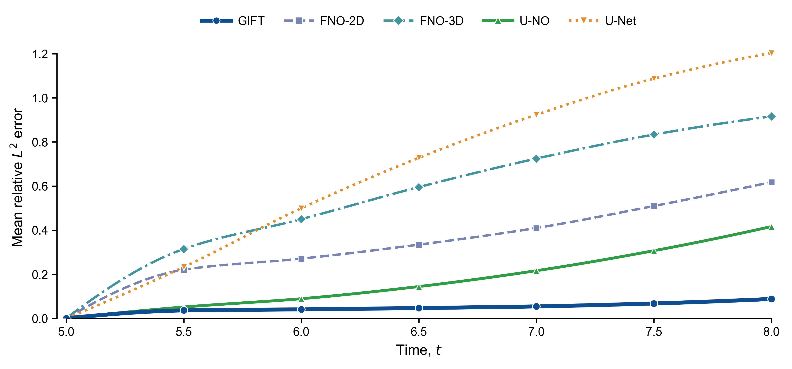

# GIFT

**Learning interpretable field generators**  
**从观测数据学习可解释的场生成器**

[English](#english) · [中文](#中文) · [Experiments / 实验记录](EXPERIMENTS.md) · [Getting started / 使用指南](docs/GETTING_STARTED.md)

Reference results from the experimental record; not a new reproduction run. / 图示为原实验记录中的结果，并非此次重新运行的结果。

## English

GIFT learns a continuous-time field generator from observed trajectories. An interpretable low-frequency component is combined with a learned high-frequency branch and local correction for recursive prediction. This project studies equation identification, long-horizon prediction and cross-resolution transfer in two-dimensional vorticity dynamics.

### Explore the project

- **Understand the results:** read the unchanged [experimental record](EXPERIMENTS.md), covering three main experiments (M1–M3) and three supporting experiments (S1–S3).
- **Check the results quickly:** use the supplied reference tables, recompute predictions with trained checkpoints, or read PINN parameters from recovered numeric terminal states. These are different forms of verification and are labelled separately.
- **Train independently:** GIFT, FNO, U-NO and U-Net have independent entry points; resume continues that run's saved state, not published weights presented as fresh training. PINN known/KC supports CPU/GPU, but full-budget acceptance is unfinished and open training remains gated. See [current verification status](docs/REPRODUCIBILITY_STATUS.md).

The dataset is distributed separately for a future Zenodo deposit; it is **not included in this Git repository**. Third-party algorithm implementations are also not bundled. Please obtain the authors' pinned repositories and follow the [adapter guides](docs/THIRD_PARTY_SOURCES.md).

**Release status:** this is a private release candidate under validation. Check [verified capabilities and remaining issues](docs/REPRODUCIBILITY_STATUS.md) before relying on from-scratch reproduction claims. No cross-device bitwise-identical result is promised.

## 中文

GIFT 从观测轨迹中学习连续时间的场生成器，将可解释的低频部分、高频学习支路与递归局部修正结合起来。本项目以二维涡量动力学为对象，研究方程识别、长时预测及跨分辨率泛化。

### 从这里开始

- **了解实验：** [实验记录](EXPERIMENTS.md) 保留原文，包含三个主实验 M1–M3 和三个补充实验 S1–S3。
- **快速核验：** 可以查看随附的参照表格、用训练好的检查点重新计算预测，或从恢复的数值终态读取 PINN 参数；这些不同形式的验证会明确区分。
- **独立训练：** GIFT、FNO、U-NO 和 U-Net 已提供独立入口，断点续算延续本次状态，不将读取已发布权重冒充从零训练。PINN known/KC 支持 CPU/GPU，但完整预算验收尚未完成，open 训练仍关闭。详见[当前验证状态](docs/REPRODUCIBILITY_STATUS.md)。

数据另行打包，供后续上传 Zenodo，**不包含在本 Git 仓库中**。其他算法的实现也不随仓库分发，请从原作者仓库获取固定版本，并参照[适配说明](docs/THIRD_PARTY_SOURCES.md)接入。

**当前状态：** 本项目仍是私有发布候选，正在验证。使用前请查看[已验证范围及待解决问题](docs/REPRODUCIBILITY_STATUS.md)；目前不承诺不同设备上的逐位一致结果。

## Acknowledgements / 致谢

We thank the authors and contributors of [NeuralOperator / FNO](https://github.com/neuraloperator/neuraloperator), [U-NO](https://github.com/ashiq24/UNO), and [Turbulent-Flow-Nets](https://github.com/Rui1521/Turbulent-Flow-Nets), together with the equation-discovery projects listed in the [source and attribution guide](docs/THIRD_PARTY_SOURCES.md). Their research and shared implementations make careful comparison possible. Please cite and acknowledge the original work when using those methods.

感谢 NeuralOperator / FNO、U-NO、Turbulent-Flow-Nets，以及[来源与署名指南](docs/THIRD_PARTY_SOURCES.md)所列方程发现项目的作者和贡献者。他们的研究与共享实现使严谨比较成为可能。使用相应方法时，请引用原始研究并保留署名。

## License / 许可

GIFT's first-party software and documentation retain the existing [MIT license](LICENSE). Dataset rights are stated separately in the data package; upstream projects remain subject to their own terms. Acknowledgement alone does not replace permission where permission is required.

GIFT 自有软件与文档沿用 [MIT 许可证](LICENSE)。数据包及上游项目分别适用其自身的授权条件；致谢并不代替必要的授权。
