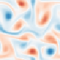
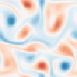

<div align="center">

# GIFT

**Generator Identification via Field Tomography**

<sub>Learning the continuous-time generator of a flow directly from trajectories, and turning the surrogate's prediction mechanism into an explicit, checkable PDE</sub>

[**English**](#english) &nbsp;·&nbsp; [**中文**](#中文)

</div>

---

## English

### In one sentence

Traditional surrogates predict the field a fixed time lag ahead; GIFT changes the object of learning. It learns the **continuous-time generator** that governs the flow's *instantaneous* evolution:

```
G(ω) = C + A(ω) + Q(ω, ω)
```

A state a finite lag later is merely the time integral of that generator, and the generator *is* the governing law. Prediction and explicit PDE-parameter identification therefore share one mathematical object: the surrogate's mechanism is no longer a black-box map hidden in network weights, but a continuous dynamical object whose physical correctness can be checked.

### Method

| Component | Description |
| --- | --- |
| Generator decomposition | The generator splits into a state-independent but spatially varying bias field `C`, a translation-equivariant linear operator `A(ω)`, and a nonlinear operator `Q(ω, ω)`. The state is the vorticity field of the two-dimensional incompressible Navier–Stokes system. |
| Field tomography | Translation equivariance of the linear operator and quadratic homogeneity of the nonlinear operator are distinct signatures in amplitude response. Exploiting that difference, the quadratic path is trained **alternately** with the linear and bias paths so that the paths are separated and reconstructed from data, without writing down the homogeneity identities explicitly. |
| Quadratic field-interaction unit | Nonlinearity comes from a structured field operator rather than an activation function: two learnable spectral filters act on the same input field, their outputs are multiplied pointwise, and the per-unit results are summed with weights (Fig. 1E). |
| High-frequency branch | The `Q`<sub>21</sub> high-frequency component is predicted by a separately trained branch, trained after the generator and then coupled with it in one integration (Fig. 1D). |
| Recursive local correction | A fixed, gradient-free rule applied after each complete RK4 step: local median residuals of the de-meaned field are clipped at an amplitude scale of `ℓ` = 2.1`σ`, under an anomalous-grid-point safety cap `K`<sub>N</sub> (40, 90, 160 for `N` = 64, 96, 128). |
| Physical interpretability check | With the generator frozen, known N–S equation terms are fitted to each path's output and the recovered coefficients are compared with the true ones — a quantitative test of whether the surrogate learned the correct physics. |

<p align="center">
  
</p>

<p align="center"><sub><b>Figure 1 | GIFT architecture and prediction process.</b> (A) Densely sampled continuous flow trajectories. (B) Fourier transform and fixed-band decomposition build the training data: components inside the <i>P</i><sub>21</sub> band enter the main path, <i>Q</i><sub>21</sub> high-frequency components enter the high-frequency branch. (C) Field tomography: differing amplitude responses separate the quadratic, linear and bias-field paths, which are learned alternately. (D) High-frequency branch. (E) Quadratic field-interaction unit. (F) The generator is advanced to the next instant by fourth-order Runge–Kutta integration.</sub></p>

### Results

Every number below is a measured result completed and published under the repository's current protocol: 1,000 `N` = 64 training trajectories (`t` = 0.0–10.0, spacing 0.02), of which GIFT-Lite retains the first 50 (Lite denotes reduced training data, not a smaller network). The test set is **180 trajectories** (1040–1219) that took part in no method's training, and each prediction time is scored separately.

#### M1 | Equation-parameter identification

True coefficients `(ν, β, γ)` = (0.01, 1, 1), excluded from training.

| Noise | GIFT ν APE | GIFT β APE | GIFT γ APE |
| --- | ---: | ---: | ---: |
| 0% | **0.484%** | **0.466%** | **0.030%** |
| 1% | **4.361%** | **0.877%** | **0.040%** |
| 10% | 64.852% | 19.778% | **0.783%** |

At 0% and 1% noise GIFT attains the lowest absolute percentage error (APE) on all three parameters among the five configurations; at 10% noise `ν` degrades sharply — the current field-tomography procedure cannot separate the nonlinear term accurately under high noise.

> ⚠️ This capability is **parameter identification under a known governing-equation structure**, not discovery of an arbitrary PDE from an unknown candidate library, and it does not replace the "structure and parameters both unknown" setting that PDE-FIND or PINN-SR address.

#### M2 | Recursive prediction (`N` = 64, `t` = 5.0 → 8.0)

GIFT and GIFT-Lite start from the true state at `t` = 5.0 and integrate recursively with Δ`t` = 0.02; the two FNO baselines take the 46 historical states from `t` = 4.1–5.0 as input.

| Time | GIFT | GIFT-Lite | FNO-2D | FNO-3D | U-NO | U-Net |
| ---: | ---: | ---: | ---: | ---: | ---: | ---: |
| 5.5 | **0.021901** | 0.036061 | 0.221038 | 0.315175 | 0.030129 | 0.233574 |
| 6.0 | **0.021058** | 0.040763 | 0.271467 | 0.450682 | 0.041116 | 0.500918 |
| 6.5 | **0.021651** | 0.046963 | 0.335630 | 0.595549 | 0.060576 | 0.730157 |
| 7.0 | **0.024000** | 0.054451 | 0.413802 | 0.725142 | 0.086921 | 0.927827 |
| 7.5 | **0.028859** | 0.067797 | 0.515927 | 0.832534 | 0.122484 | 1.091212 |
| 8.0 | **0.036488** | 0.088190 | 0.624730 | 0.915958 | 0.165307 | 1.208035 |

GIFT has the lowest mean full-field relative error at all six reported times, and all six methods stay finite on 180/180 trajectories over the full interval; no failed sample is excluded from the statistics.

<p align="center">
  
</p>

<p align="center"><sub>Mean full-field relative <i>L</i><sup>2</sup> error of the six methods over 180 test trajectories. Curves are PCHIP interpolants through exactly the seven reported sample points, shown for trend only.</sub></p>

<p align="center">
  
  
  
</p>

<p align="center"><sub>Vorticity of trajectory 1045 at <i>t</i> = 8.0: numerical reference (left), GIFT (centre), and the strongest baseline U-NO (right; full-field relative error 0.036488 / 0.165307). All three panels share one colour scale.</sub></p>

#### M3 | Cross-resolution prediction (zero-shot)

Trained on `N` = 64 only, with network parameters and Fourier modes unchanged, then evaluated directly on `N` = 96 and `N` = 128 grids from `t` = 5.0; the target resolution takes no part in training or model selection.

| `t` = 6.0 | `N` = 64 | `N` = 96 | `N` = 128 |
| --- | ---: | ---: | ---: |
| **GIFT** | **0.021058** | **0.020947** | **0.020933** |
| GIFT-Lite | 0.040763 | 0.039754 | 0.039742 |
| FNO-2D | 0.271467 | 0.271199 | 0.271295 |
| FNO-3D | 0.450682 | 0.451181 | 0.452352 |

The learned generator is grid-invariant: on every grid and at every reported time `t` > 5.0, GIFT and GIFT-Lite stay below both FNO baselines. The experiment measures direct applicability on the discrete grids tested and **does not imply recovery of arbitrarily high frequencies**.

<p align="center">
  
</p>

<p align="center"><sub>Mean full-field relative <i>L</i><sup>2</sup> error of four methods trained on <i>N</i> = 64 only, on three native grids (180 paired trajectories).</sub></p>

#### Side experiments S1–S4

| Experiment | Result |
| --- | --- |
| **S1 High-frequency branch** | At `t` = 6.0 it reduces the GIFT full-field error by 60.04%, 57.54% and 57.55% on `N` = 64, 96 and 128, and the GIFT-Lite error by 33.63%, 31.98% and 31.98%. |
| **S2 Recursive local correction** | On the held-out test set it keeps trajectory 1062 of GIFT-Lite finite. Full-data GIFT never triggered the correction. |
| **S3 Random-seed stability** | With the generator fixed and the high-frequency branch trained under three seeds, the largest coefficient of variation on the main metrics is about 0.321% for GIFT and 0.313% for GIFT-Lite. |
| **S4 Initial-condition distribution** | Repeating the comparison on a smooth Gaussian random-field population, full-data GIFT still has the lowest mean error at every reported time (`t` = 8.0: 0.021035) and U-NO is the closest baseline (0.173805). Full-data GIFT and all four baselines stay finite on 180/180 test trajectories; GIFT-Lite loses 17 of 180 after `t` ≈ 6.9, so its later values are finite-subset statistics and are reported as such. |

> **Scope.** Conclusions are limited to this project's data distribution, training protocol and the `N` = 64, 96, 128 grids; they are not an error guarantee or a numerical-stability theorem at arbitrary resolution, and equal epochs do not mean equal parameter-update counts or equal compute. Full detail in [EXPERIMENTS.md](EXPERIMENTS.md) and [TRAINING_PROTOCOL.md](docs/TRAINING_PROTOCOL.md).

### Manuscript provenance

The repository's published results use a **different protocol from the manuscript** and the two are not directly comparable:

| | Manuscript | This repository |
| --- | --- | --- |
| Model | 50 training trajectories | 1,000 training trajectories (plus the 50-trajectory GIFT-Lite) |
| Test set | 1,000–1199, 200 trajectories | 1,040–1219, 180 trajectories |
| Error at `t` = 8.0 | 0.0875 | GIFT 0.036488; GIFT-Lite 0.088190 |
| Example trajectories | 1005 / 1130 | 1045 / 1150 |

The manuscript's headline results correspond to the reduced-data configuration that this repository now calls **GIFT-Lite**, evaluated on an earlier split. Every number in this README and in [EXPERIMENTS.md](EXPERIMENTS.md) comes from the repository's own published results.

### Quick start

Data and third-party implementations live outside the project and are located through `GIFT_DATA_ROOT` and `GIFT_EXTERNAL_ROOT`; installation is described in [SETUP.md](docs/SETUP.md). Each model and each experiment runs separately.

```shell
# Evaluate directly with the weights shipped with the project
python -m scripts.run_experiment M2 --output ../runs/M2 --skip-plots

# Train a single model (one command per model)
python -m scripts.run_training uno --data-profile canonical --run-training --output ../runs/uno

# Check files, completion records and figure provenance of published results
python -m scripts.verify_published_results --experiment M3 --result-dir results/formal/M3_cross_resolution
```

Layout: `src/gift/` (generator model, band decomposition, data splits), `training/` (one training entry point per model), `experiments/formal/` (launchers and evaluation for M1–M3 and S1–S4), `results/formal/` (summary CSV/JSON and SVG figures), `artifacts/` (weights and checkpoints), `tests/` (data contract, checkpoint identity and result-integrity tests). Further documentation is under [docs/](docs/).

### External code and acknowledgements

The comparison experiments use the upstream open-source implementations below. Upstream sources are **not distributed with this repository** and must be obtained from their owners under their own terms; only pinned commits and source hashes are recorded here for reproducibility. We thank the authors and contributors of these projects.

| Upstream project | Used for | Pinned version | Licence |
| --- | --- | --- | --- |
| [neuraloperator/neuraloperator](https://github.com/neuraloperator/neuraloperator) | Network structure and training objective of the FNO-2D and FNO-3D baselines | `01d2aeca` | See upstream (not declared in this project) |
| [ashiq24/UNO](https://github.com/ashiq24/UNO) | U-shaped neural operator and integral operator of the U-NO baseline | `19462d82` | BSD-2-Clause |
| [Rui1521/Turbulent-Flow-Nets](https://github.com/Rui1521/Turbulent-Flow-Nets) | Encoder/decoder structure of the U-Net baseline | `229da3e0` | Not declared upstream; **do not redistribute** |
| [isds-neu/EQDiscovery](https://github.com/isds-neu/EQDiscovery) | PINN-SR and PINN-SR-KC configurations | `9a20ebe6` | Not declared upstream |
| [snagcliffs/PDE-FIND](https://github.com/snagcliffs/PDE-FIND) | PDE-FIND and PDE-FIND-KC configurations | `86911349` | Not declared upstream |
| [tensorflow/tensorflow](https://github.com/tensorflow/tensorflow) (tag `v1.15.0`) | NAdam and L-BFGS external optimizer implementations | `590d6eef` | Apache-2.0 |

Adaptations to upstream code are limited to what is necessary, small, and individually explainable (data tensor layout, batching, cross-resolution input, history length). Autograd is not taken over, backward operators are not replaced, and optimizer kernels are not reimplemented. See [EXTERNAL_ADAPTATIONS.md](docs/EXTERNAL_ADAPTATIONS.md) for the itemised list and [`external_sources.json`](external_sources.json) for pinned commits and SHA-256 hashes. Please cite the original research when using these methods.

### License

GIFT software and documentation are released under the [MIT licence](LICENSE). Data packages and external projects are governed by their own terms.

---

<a id="中文"></a>

## 中文

**基于场层析的生成元识别：具备物理可解释性的流体动力学代理模型**

<sub>从流场轨迹中直接学习连续时间生成元，并把代理模型的预测机制还原为可检验的偏微分控制方程</sub>

### 一句话概括

传统代理模型直接预测固定时间间隔后的流场；GIFT 换一个对象——它学习决定流场**瞬时演化**的**连续时间生成元**：

```
G(ω) = C + A(ω) + Q(ω, ω)
```

有限时间间隔后的状态只是生成元的时间积分结果，而生成元本身对应系统的控制规律。因此代理模型的预测与显式 PDE 参数识别共享同一个数学对象：预测机制不再是藏在网络权重里的黑盒映射，而是一个可以被检验物理正确性的连续动力学对象。

### 方法要点

| 环节 | 内容 |
| --- | --- |
| 生成元分解 | 生成元拆为与状态无关但可随空间变化的偏置场 `C`、平移等变线性算子 `A(ω)` 与非线性算子 `Q(ω, ω)`；状态取二维不可压缩 Navier–Stokes 的涡量场。 |
| 场层析 | 线性算子的平移等变性与非线性算子的二次齐次性是不同特征响应；按此差异**交替训练**二次通道与线性、偏置场通道，把它们从数据中分离并重建，训练中无需显式构造齐次特征式。 |
| 二次场相互作用单元 | 非线性由结构化场算子而非激活函数提供：同一输入场经两个可学习谱滤波器后逐点相乘，再对各单元加权求和（图 1E）。 |
| 高频支路 | `Q`<sub>21</sub> 高频分量交由单独训练的网络支路预测，生成元训练结束后训练，两部分耦合积分（图 1D）。 |
| 递归局部修正 | 每个完整 RK4 步后执行的固定规则：按幅值尺度 `ℓ` = 2.1`σ` 裁剪去均值场的局部中值残差，并设异常网格点安全上限 `K`<sub>N</sub>（`N` = 64、96、128 时分别为 40、90、160）。 |
| 物理可解释性检验 | 生成元冻结后，用已知 N–S 方程项拟合各通道输出，将读出系数与真实控制方程系数对比——对「是否学到正确物理」的可量化检验。 |

<p align="center">
  
</p>

<p align="center"><sub><b>图 1｜GIFT 架构与预测过程。</b>(A) 稠密采样的连续流场轨迹。(B) 傅里叶变换与固定频带分解构造训练数据：<i>P</i><sub>21</sub> 分量进入主路径，<i>Q</i><sub>21</sub> 高频分量进入高频支路。(C) 场层析：利用各通道振幅响应差异，交替学习二次通道、线性通道与偏置场通道。(D) 高频支路。(E) 二次场相互作用单元。(F) 生成元经四阶 Runge–Kutta 积分推进至下一时刻。</sub></p>

### 主要结果

以下均为本仓库当前协议下**完成并发布的实测结果**：1,000 条 `N` = 64 训练轨迹（`t` = 0.0–10.0，间隔 0.02），另保留使用其中前 50 条的 GIFT-Lite（Lite 表示训练数据减少，不表示网络更小）；测试集为未参与任何方法训练的 **180 条轨迹**（1040–1219），每个预测时刻单独评价。

#### M1｜方程参数识别

真实系数 `(ν, β, γ)` = (0.01, 1, 1)，真实系数不参与训练。

| 噪声 | GIFT ν APE | GIFT β APE | GIFT γ APE |
| --- | ---: | ---: | ---: |
| 0% | **0.484%** | **0.466%** | **0.030%** |
| 1% | **4.361%** | **0.877%** | **0.040%** |
| 10% | 64.852% | 19.778% | **0.783%** |

0% 与 1% 噪声下，GIFT 对三个参数的绝对百分比误差（APE）均为五种配置中最低；10% 噪声下 `ν` 显著退化——当前场层析过程无法在高噪声下准确分离非线性项。

> ⚠️ 该能力属于**已知控制方程结构下的参数识别**，不是在未知候选结构中从头发现任意 PDE，不能替代 PDE-FIND 或 PINN-SR 所面向的「结构与参数均未知」任务。

#### M2｜递归预测（`N` = 64，`t` = 5.0 → 8.0）

GIFT 与 GIFT-Lite 从 `t` = 5.0 的真值状态出发以 Δ`t` = 0.02 递归积分；两个 FNO 基线使用 `t` = 4.1–5.0 的 46 帧历史状态。

| 时间 | GIFT | GIFT-Lite | FNO-2D | FNO-3D | U-NO | U-Net |
| ---: | ---: | ---: | ---: | ---: | ---: | ---: |
| 5.5 | **0.021901** | 0.036061 | 0.221038 | 0.315175 | 0.030129 | 0.233574 |
| 6.0 | **0.021058** | 0.040763 | 0.271467 | 0.450682 | 0.041116 | 0.500918 |
| 6.5 | **0.021651** | 0.046963 | 0.335630 | 0.595549 | 0.060576 | 0.730157 |
| 7.0 | **0.024000** | 0.054451 | 0.413802 | 0.725142 | 0.086921 | 0.927827 |
| 7.5 | **0.028859** | 0.067797 | 0.515927 | 0.832534 | 0.122484 | 1.091212 |
| 8.0 | **0.036488** | 0.088190 | 0.624730 | 0.915958 | 0.165307 | 1.208035 |

六个报告时刻中 GIFT 的平均全场相对误差均最低；六种方法在完整预测区间都保持 180/180 条轨迹有限，统计未剔除失败样本。

<p align="center">
  
</p>

<p align="center"><sub>六种方法在 180 条测试轨迹上的平均全场相对 <i>L</i><sup>2</sup> 误差随时间的变化；曲线为严格通过 7 个报告样本点的 PCHIP 插值，仅用于显示趋势。</sub></p>

<p align="center">
  
  
  
</p>

<p align="center"><sub>轨迹 1045 在 <i>t</i> = 8.0 的涡量场：左为数值真值，中为 GIFT，右为表现最好的基线 U-NO（全场相对误差 0.036488 / 0.165307），三面板共用同一色标。</sub></p>

#### M3｜跨分辨率预测（zero-shot）

仅用 `N` = 64 数据训练，网络参数与 Fourier 模态数保持不变，直接在 `N` = 96、128 网格上从 `t` = 5.0 开始预测；目标分辨率不参与训练或模型选择。

| `t` = 6.0 | `N` = 64 | `N` = 96 | `N` = 128 |
| --- | ---: | ---: | ---: |
| **GIFT** | **0.021058** | **0.020947** | **0.020933** |
| GIFT-Lite | 0.040763 | 0.039754 | 0.039742 |
| FNO-2D | 0.271467 | 0.271199 | 0.271295 |
| FNO-3D | 0.450682 | 0.451181 | 0.452352 |

学习到的生成元是网格不变的：每个网格、每个 `t` > 5.0 的报告时刻，GIFT 与 GIFT-Lite 均低于两个 FNO 基线。跨分辨率实验评价的是模型在所测离散网格上的直接适用性，**不表示可以恢复无限高的频率**。

<p align="center">
  
</p>

<p align="center"><sub>仅在 <i>N</i> = 64 训练的四种方法在三个原生网格上的平均全场相对 <i>L</i><sup>2</sup> 误差（180 条配对轨迹）。</sub></p>

#### 支线实验 S1–S4

| 实验 | 结论 |
| --- | --- |
| **S1 高频支路** | `N` = 64、96、128 的 `t` = 6.0 处分别降低 GIFT 全场误差 60.04%、57.54%、57.55%，降低 GIFT-Lite 33.63%、31.98%、31.98%。 |
| **S2 递归局部修正** | 在独立测试集上避免 GIFT-Lite 的轨迹 1062 出现非有限值；全数据 GIFT 未触发修正。 |
| **S3 随机种子稳定性** | 固定生成元、独立训练高频支路三个种子，GIFT 与 GIFT-Lite 主要指标的最大变异系数约 0.321% 与 0.313%。 |
| **S4 初值分布对照** | 在平滑高斯随机场初值分布上重复同一比较，全数据 GIFT 的报告时刻平均误差仍为最低（`t` = 8.0 为 0.021035），U-NO 为最接近的基线（0.173805）。全数据 GIFT 与四个基线均保持 180/180 条测试轨迹有限；GIFT-Lite 有 17/180 条在 `t` ≈ 6.9 之后失稳，其后续数值为有限子集统计并已如实标注。 |

> **适用范围。** 结论限于本项目的数据分布、训练协议与 `N` = 64、96、128 网格，不构成任意分辨率上的误差保证或数值稳定性定理；相同 epoch 不代表相同参数更新次数或计算量。完整口径见 [EXPERIMENTS.md](EXPERIMENTS.md) 与 [TRAINING_PROTOCOL.md](docs/TRAINING_PROTOCOL.md)。

### 论文口径说明

本仓库发布的结果与论文手稿的报告口径**不同，两者不可直接比较**：

| | 论文手稿 | 本仓库当前协议 |
| --- | --- | --- |
| 模型 | 50 条训练轨迹的配置 | 1,000 条训练轨迹（另保留 50 条的 GIFT-Lite） |
| 测试集 | 1,000–1199，共 200 条 | 1,040–1219，共 180 条 |
| `t` = 8.0 终点误差 | 0.0875 | GIFT 0.036488；GIFT-Lite 0.088190 |
| 示例轨迹 | 1005 / 1130 | 1045 / 1150 |

手稿的主力结果对应本仓库现在称为 **GIFT-Lite** 的缩减数据配置与更早的数据划分；本 README 与 [EXPERIMENTS.md](EXPERIMENTS.md) 中所有数值均取本仓库当前已发布结果。

### 快速开始

数据与第三方实现位于项目之外，分别通过 `GIFT_DATA_ROOT` 与 `GIFT_EXTERNAL_ROOT` 指定；安装方式见 [SETUP.md](docs/SETUP.md)。每个模型与实验分别运行。

```shell
# 使用随项目提供的权重直接评价
python -m scripts.run_experiment M2 --output ../runs/M2 --skip-plots

# 独立训练一个模型（每个模型一条命令）
python -m scripts.run_training uno --data-profile canonical --run-training --output ../runs/uno

# 核对已发布结果的文件、完成记录与图像来源
python -m scripts.verify_published_results --experiment M3 --result-dir results/formal/M3_cross_resolution
```

代码组织：`src/gift/`（生成元模型、频带分解、数据划分）、`training/`（各模型独立训练入口）、`experiments/formal/`（M1–M3、S1–S4 启动与评价）、`results/formal/`（汇总 CSV/JSON 与 SVG 图像）、`artifacts/`（权重与检查点）、`tests/`（数据契约、检查点身份与结果完整性测试）。其余文档见 [docs/](docs/)。

### 外部代码与致谢

本项目在对比实验中使用了以下上游开源实现。上游源码**不随本仓库分发**，需按各自条款从上游获取；本仓库只记录固定提交与源码散列以便复现。对各项目的作者与贡献者表示感谢。

| 上游项目 | 用途 | 固定版本 | 许可状态 |
| --- | --- | --- | --- |
| [neuraloperator/neuraloperator](https://github.com/neuraloperator/neuraloperator) | FNO-2D、FNO-3D 基线的网络结构与训练目标 | `01d2aeca` | 见上游（本项目内未声明） |
| [ashiq24/UNO](https://github.com/ashiq24/UNO) | U-NO 基线的 U 形神经算子与积分算子 | `19462d82` | BSD-2-Clause |
| [Rui1521/Turbulent-Flow-Nets](https://github.com/Rui1521/Turbulent-Flow-Nets) | U-Net 基线的编码器 / 解码器结构 | `229da3e0` | 上游未声明许可，**不得再分发** |
| [isds-neu/EQDiscovery](https://github.com/isds-neu/EQDiscovery) | PINN-SR 及 PINN-SR-KC 配置 | `9a20ebe6` | 上游未声明许可 |
| [snagcliffs/PDE-FIND](https://github.com/snagcliffs/PDE-FIND) | PDE-FIND 及 PDE-FIND-KC 配置 | `86911349` | 上游未声明许可 |
| [tensorflow/tensorflow](https://github.com/tensorflow/tensorflow)（tag `v1.15.0`） | NAdam 与 L-BFGS 外部优化器实现 | `590d6eef` | Apache-2.0 |

对上游实现只做必要、少量且可逐项说明的适配（数据张量布局、批量组织、跨分辨率输入、历史帧数等），不接管自动微分、不替换反向算子、不重新实现优化器内核。逐项说明见 [EXTERNAL_ADAPTATIONS.md](docs/EXTERNAL_ADAPTATIONS.md)，固定提交与源码散列见 [`external_sources.json`](external_sources.json)。使用相关方法时请引用其原始研究。

### 许可

GIFT 软件与文档使用 [MIT 许可](LICENSE)。数据包与外部项目适用各自的条款。
