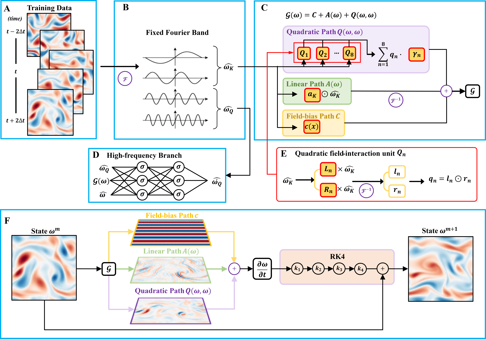
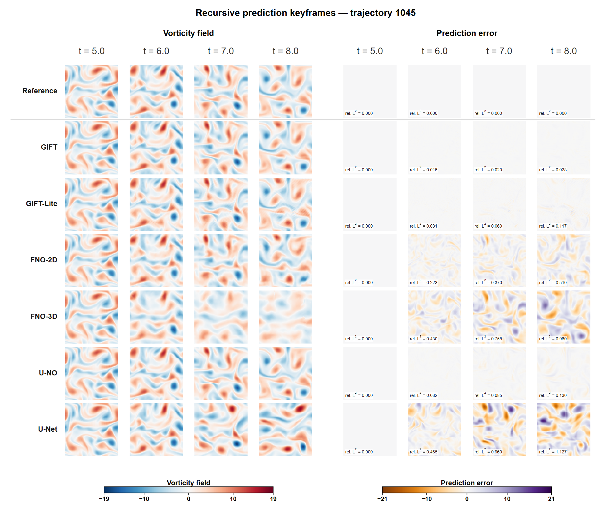

# GIFT

**Generator identification via field tomography: A fluid dynamics surrogate model with testable physical correctness**

A data-driven framework for learning continuous-time generators from flow-field trajectories. Identifying the continuous-time generator that governs instantaneous flow-field evolution yields a model that can also be mapped back to testable governing physical laws without extensive parameter search.

[English](#english) · [中文](#中文) · [Setup](docs/SETUP.md) · [Experiments](EXPERIMENTS.md)

[](docs/ALGORITHM.md)

[](EXPERIMENTS.md)

*Both plates are links. The first opens the [algorithm description](docs/ALGORITHM.md); the second, figure M2-2 for held-out trajectory 1045 at t = 5.0, 6.0, 7.0, 8.0, opens the [experiment record](EXPERIMENTS.md).*

## English

### What does GIFT learn?

For a system whose instantaneous evolution is determined solely by its current state, the **continuous-time generator** is the dynamical operator that maps the current state field to its instantaneous time derivative,

$$\frac{\mathrm{d}\omega}{\mathrm{d}t} = G^{\dagger}(\omega),\qquad G(\omega) = C + A(\omega) + Q(\omega,\omega),$$

where $\omega$ is the vorticity field of two-dimensional incompressible flow. GIFT decomposes the generator model into a bias-field channel, a linear channel and a nonlinear channel, each containing a learnable operator. The superscript $\dagger$ distinguishes the true system generator from the approximate model obtained through learning. GIFT uses field tomography to separate these three components from flow-field trajectories by exploiting differences in amplitude responses among them: $A(\lambda\omega)=\lambda A(\omega)$ and $Q(\lambda\omega,\lambda\omega)=\lambda^{2}Q(\omega,\omega)$.

Because a state one finite lag later is only the time integral of the generator, GIFT thereby transforms the surrogate model's prediction mechanism from a black-box mapping hidden in neural network weights into an explicitly parameterized continuous-time generator, which can also be mapped back to testable governing physical laws. The component-by-component description is in [docs/ALGORITHM.md](docs/ALGORITHM.md).

### How does it work?

- **Generator model** — a parameterized model fitted to flow-field trajectories to approximate the continuous-time generator, organized into bias-field, linear and nonlinear channels.
- **Field tomography** — separating and learning different components of the generator from flow-field trajectories by exploiting differences in amplitude responses among the bias-field, linear and nonlinear channels.
- **Quadratic field-interaction unit** — a unit that applies two learnable spectral filters to the same input field and then multiplies the resulting fields pointwise to produce a quadratic nonlinear output.
- **Learnable spectral filter** — a linear operator that applies learnable weights to individual spatial wavenumber components in the Fourier domain.
- **High-frequency branch** — a separately trained branch that takes the current state and predicts the complementary band, then coupled with the generator in a single fourth-order Runge–Kutta integration.
- **Recursive local correction** — a fixed rule applied after each complete Runge–Kutta step during recursive rollouts, under a safety cap on anomalous grid points (40, 90 and 160 for $N$ = 64, 96 and 128).
- **Physical interpretability** — with the generator frozen, the Navier–Stokes equation terms are fitted to the output of each channel, reading out equation parameters with physical meaning.

### How well does it work?

Every number below is a completed, published measurement under the protocol recorded in [EXPERIMENTS.md](EXPERIMENTS.md). Per-time tables, seed standard deviations, finiteness counts and run entry points are there too; this section is a pointer, not the record.

- **Prediction of flow evolution** (M2): on 180 held-out trajectories, GIFT has the lowest mean full-field relative $L^{2}$ error of the six methods at all six reported times, from 0.021901 at $t$ = 5.5 to 0.036488 at $t$ = 8.0, and all six methods stay finite on 180/180 trajectories.
- **Cross-resolution prediction** (M3, zero-shot): trained on $N$ = 64 only, GIFT reaches 0.020947 on $N$ = 96 and 0.020933 on $N$ = 128 at $t$ = 6.0, against 0.021058 on $N$ = 64, and stays below both FNO baselines on every grid tested.
- **PDE parameter identification** (M1): at 0% and 1% noise GIFT attains the lowest absolute percentage error on all three equation parameters (0%: 4.343%, 1.619% and 4.121% against the true 0.01, 1 and 1).
- **High-frequency branch, recursive local correction, seed stability and initial-condition distribution** (S1–S4, Supplementary Materials): the high-frequency branch lowers GIFT's full-field error by about 58–60%; recursive local correction keeps GIFT-Lite trajectory 1062 finite; the largest seed-to-seed coefficient of variation is 0.321%; and on a separate Gaussian random-field population GIFT still has the lowest mean error at every reported time ($t$ = 8.0: 0.021035, against 0.173805 for the closest baseline), with GIFT-Lite's 17 of 180 non-finite trajectories reported rather than removed.

These conclusions are limited to this project's data distribution, training protocol and the $N$ = 64, 96 and 128 grids, and are not an error guarantee or a numerical-stability theorem at arbitrary resolution. Equal epoch counts do not mean equal parameter-update counts or equal compute: GIFT starts from a single state at $t$ = 5.0 while the FNO baselines consume 46 historical frames, and GIFT's generator and high-frequency branch are trained under separate budgets. The full statement, with seed SDs, finiteness counts and per-job timings, is in [EXPERIMENTS.md](EXPERIMENTS.md) section 6 and [docs/TRAINING_PROTOCOL.md](docs/TRAINING_PROTOCOL.md).

### How to get started?

Run everything from the repository root. The data package and the fixed upstream sources live outside this repository and are addressed by `GIFT_DATA_ROOT` and `GIFT_EXTERNAL_ROOT`.

```shell
# 1. install (tested stack: Python 3.10.19, PyTorch 2.10.0 with CUDA 12.6)
python -m venv ../gift-env            # then activate it with your shell's activation command
python -m pip install torch==2.10.0 --index-url https://download.pytorch.org/whl/cu126
python -m pip install -r requirements-reproduction.txt
python -m pip install -e .

# 2. point at the data package and the external sources, then fetch the pinned commits
export GIFT_DATA_ROOT=/absolute/path/gift-data        # PowerShell form: see docs/SETUP.md
export GIFT_EXTERNAL_ROOT=/absolute/path/gift-external
python -m scripts.verify_data --root "$GIFT_DATA_ROOT"
python -m scripts.prepare_external --root "$GIFT_EXTERNAL_ROOT"

# 3. evaluate an experiment with the weights shipped with the project
python -m scripts.run_experiment M2 --output ../runs/M2 --skip-plots

# 4. or train one model on your own device (one command per model)
python -m scripts.run_training uno --data-profile canonical --run-training --output ../runs/uno
python -m scripts.run_training gift_generator --run-training \
  --dataset "$GIFT_DATA_ROOT/fno/fno1000_n64_t0_t10_dt0p02.h5" --output ../runs/gift_generator

# 5. check files, completion records and figure provenance of a published result
python -m scripts.verify_published_results --experiment M3 --result-dir results/formal/M3_cross_resolution
```

CPU is supported by the GIFT entry points; the external prediction baselines accept CPU only with an explicit `--tiny` diagnostic budget, and their formal budget requires CUDA. Hardware, numerical libraries and the retained nondeterministic upstream GPU operators can move floating-point values, so cross-device bitwise equality is not promised. Full environments, the separate PINN environment, every per-model command and the resume boundaries are in [docs/SETUP.md](docs/SETUP.md).

### Where does the data come from?

The observation data are a separate, separately citable package, and downloading it is not the only way to run this code.

- **Dataset record** — *GIFT Navier–Stokes input data*, ScienceDB, DOI `10.57760/sciencedb.013lo` (CSTR `31253.11.sciencedb.013lo`), licensed CC BY 4.0. The record is under review at the repository, so the identifier is assigned but does not resolve yet; it becomes active once the record is published. Only this public DOI is given here — no private or limited-access link.
- **Generating it locally instead** — the repository holds the complete data-generation chain, so the same fields can be produced on your own device: `scripts/generate_data` (clean fields), `generate_noise` and `generate_sampling` (M1 inputs), `derive_dense_frames` (coarse and cross-resolution frames), `generate_gaussian_data` (S4), then `assemble_generated_data`, `prepare_prediction_package` and `verify_data` to assemble and check the result. Commands, recorded parameters and continuation boundaries are in [docs/DATA_GENERATION.md](docs/DATA_GENERATION.md); regeneration starts from initial-condition parameters and does not promise bitwise identity across devices.

### Documentation

- [docs/ALGORITHM.md](docs/ALGORITHM.md) — the generator model, field tomography, the quadratic field-interaction unit, the high-frequency branch and the recursive local correction.
- [EXPERIMENTS.md](EXPERIMENTS.md) — the numerical experiment record: protocols, per-time tables, seed SDs, finiteness counts, run entry points.
- [docs/SETUP.md](docs/SETUP.md) — environments, data package, external sources, one model per command.
- [docs/TRAINING_PROTOCOL.md](docs/TRAINING_PROTOCOL.md) — training budgets, data splits, model selection.
- [docs/RESULTS.md](docs/RESULTS.md) — how to read the published results, and why reading a table, recomputing inference and training from scratch are different operations.
- [docs/FIGURES.md](docs/FIGURES.md) — how each published SVG is regenerated from its numerical output.
- [docs/EXPERIMENT_EXECUTION.md](docs/EXPERIMENT_EXECUTION.md) · [docs/CHECKPOINTS.md](docs/CHECKPOINTS.md) · [docs/DATA_GENERATION.md](docs/DATA_GENERATION.md) · [docs/VALIDATION.md](docs/VALIDATION.md) · [docs/PERFORMANCE.md](docs/PERFORMANCE.md) · [docs/S4_PROTOCOL.md](docs/S4_PROTOCOL.md) · [docs/EXTERNAL_ADAPTATIONS.md](docs/EXTERNAL_ADAPTATIONS.md)

### Repository layout

- `src/gift/` — generator model, band decomposition, data splits, the identified-generator readout.
- `adapters/` — in-memory loaders that verify the pinned upstream sources and apply the itemised adaptations.
- `training/` — one training entry point per model.
- `experiments/formal/` — launchers and evaluation for M1–M3 and S1–S4.
- `results/formal/` — published summaries, CSV/JSON records and SVG figures with their manifests.
- `artifacts/` — weights and checkpoints with their recorded identities.
- `scripts/` — data preparation, verification, packaging and figure rendering.
- `tests/` — data contract, checkpoint identity and result-integrity tests.
- `docs/` — setup, protocol, execution and validation documentation.
- `assets/figures/` — the two plates shown above, with the vector original of the architecture plate.

The root also holds the numerical experiment record [`EXPERIMENTS.md`](EXPERIMENTS.md), the pinned upstream identities [`external_sources.json`](external_sources.json) and the working conventions [`AGENTS.md`](AGENTS.md).

### Data, code and licence

GIFT software and documentation are released under the [MIT licence](LICENSE). The data package uses CC BY 4.0; external projects are governed by their own terms.

The comparison experiments use the upstream open-source implementations below. Upstream sources are **not distributed with this repository** and must be obtained from their owners under their own terms; only pinned commits and source hashes are recorded here, in [`external_sources.json`](external_sources.json). Adaptations to upstream code are limited to what is necessary, small and individually explainable (data tensor layout, batching, cross-resolution input, history length); see [docs/EXTERNAL_ADAPTATIONS.md](docs/EXTERNAL_ADAPTATIONS.md) for the itemised list. We thank the authors and contributors of these projects, and ask that the original research be cited when using these methods.

| Upstream project | Used for | Pinned version | Licence |
| --- | --- | --- | --- |
| [neuraloperator/neuraloperator](https://github.com/neuraloperator/neuraloperator) | FNO-2D and FNO-3D baselines | `01d2aeca` | MIT |
| [ashiq24/UNO](https://github.com/ashiq24/UNO) | U-NO baseline | `19462d82` | BSD-2-Clause |
| [Rui1521/Turbulent-Flow-Nets](https://github.com/Rui1521/Turbulent-Flow-Nets) | U-Net baseline | `229da3e0` | No licence declared upstream; **do not redistribute** |
| [isds-neu/EQDiscovery](https://github.com/isds-neu/EQDiscovery) | PINN-SR configurations | `9a20ebe6` | No licence declared upstream |
| [snagcliffs/PDE-FIND](https://github.com/snagcliffs/PDE-FIND) | PDE-FIND configurations | `86911349` | No licence declared upstream |
| [tensorflow/tensorflow](https://github.com/tensorflow/tensorflow) (tag `v1.15.0`) | NAdam and L-BFGS optimizer implementations | `590d6eef` | Apache-2.0 |

Each licence entry above was read from the upstream repository **at the pinned commit**. Three of the six declare no licence, so no rights over their code are granted or implied here: obtain those sources from their owners and use them at your own discretion and risk. Apache-2.0 requires the retained notices only on redistribution, and no TensorFlow source is redistributed here.

### Citation

The comparison methods have primary references, and two upstream repositories publish an explicit citation request. Please cite the GIFT manuscript and the upstream work you use.

- **GIFT** — *Generator identification via field tomography: A fluid dynamics surrogate model with testable physical correctness* (manuscript; the Chinese version is titled 基于场层析的生成元识别：具备可检验物理正确性的流体动力学代理模型). A DOI will be listed here once one is assigned.
- **GIFT data** — *GIFT Navier–Stokes input data*, ScienceDB (CC BY 4.0), DOI `10.57760/sciencedb.013lo`. Cite this record when reusing the observation data; the identifier is assigned and resolves once the record is published.
- **FNO-2D / FNO-3D** — Z. Li, N. Kovachki, K. Azizzadenesheli, B. Liu, K. Bhattacharya, A. Stuart, A. Anandkumar, "Fourier neural operator for parametric partial differential equations", ICLR 2021 (arXiv:2010.08895). Cited by the upstream repository.
- **U-NO** — M. A. Rahman, Z. E. Ross, K. Azizzadenesheli, "U-NO: U-shaped neural operators", Trans. Mach. Learn. Res. 2023.
- **U-Net baseline** — R. Wang, K. Kashinath, M. Mustafa, A. Albert, R. Yu, "Towards physics-informed deep learning for turbulent flow prediction", KDD 2020. Cited by the upstream repository.
- **PINN-SR** — Z. Chen, Y. Liu, H. Sun, "Physics-informed learning of governing equations from scarce data", Nat. Commun. 12, 6136 (2021).
- **PDE-FIND** — S. H. Rudy, S. L. Brunton, J. L. Proctor, J. N. Kutz, "Data-driven discovery of partial differential equations", Sci. Adv. 3, e1602614 (2017).
- **TensorFlow optimizers** — Apache-2.0 software; the upstream project requests no citation.

<a id="中文"></a>

## 中文

**基于场层析的生成元识别：具备可检验物理正确性的流体动力学代理模型**

从流场轨迹中直接学习连续时间生成元的数据驱动框架。辨识支配瞬时流场演化的连续时间生成元，所得到的模型还能够被还原为可检验的物理控制规律，而无需大规模参数搜索。

### GIFT 学的是什么？

对于瞬时演化只由当前状态决定的系统，**连续时间生成元**是把当前状态场映射为其瞬时时间导数的动力学算子：

$$\frac{\mathrm{d}\omega}{\mathrm{d}t} = G^{\dagger}(\omega),\qquad G(\omega) = C + A(\omega) + Q(\omega,\omega),$$

其中 $\omega$ 为二维不可压缩流动的涡量场。GIFT 把生成元模型分解为偏置场通道、线性通道与非线性通道，每个通道各含一个可学习算子；上标 $\dagger$ 用于区分真实系统生成元与通过学习得到的近似模型。GIFT 用场层析，依据偏置场、线性与非线性通道在振幅响应上的差异，从流场轨迹中分离出这三个组成部分：$A(\lambda\omega)=\lambda A(\omega)$、$Q(\lambda\omega,\lambda\omega)=\lambda^{2}Q(\omega,\omega)$。

有限时间间隔后的状态只是生成元的时间积分结果，因此 GIFT 把代理模型的预测机制从隐藏在神经网络权重中的黑箱映射转变为可还原为可检验物理控制规律的连续时间模型。逐部件说明见 [docs/ALGORITHM.md](docs/ALGORITHM.md)。

### 它是怎么工作的？

- **生成元模型**——拟合流场轨迹以逼近连续时间生成元的参数化模型，组织为偏置场通道、线性通道与非线性通道。
- **场层析**——利用偏置场、线性与非线性通道振幅响应的差异，从流场轨迹中分离并学习生成元的不同组成部分。
- **二次场相互作用单元**——对同一输入场施加两个可学习谱滤波器，再把所得场逐点相乘，产生二次非线性输出。
- **可学习谱滤波器**——在傅里叶域对各个空间波数分量施加可学习权重的线性算子。
- **高频支路**——单独训练、读取当前状态并预测补频带的支路，与生成元耦合在同一个四阶 Runge–Kutta 积分中推进。
- **递归局部修正**——递归推演过程中每个完整 Runge–Kutta 步后执行的固定规则，并设异常网格点安全上限（$N$ = 64、96、128 时分别为 40、90、160）。
- **物理可解释性**——生成元冻结后，用 Navier–Stokes 方程项拟合各通道输出，读出具有物理意义的方程参数。

### 效果如何？

以下均为 [EXPERIMENTS.md](EXPERIMENTS.md) 所记录协议下完成并发布的实测结果。逐时刻数据表、种子标准差、有限性计数与运行入口均在该记录中，本节只作指引。

- **流场演化预测**（M2）：在 180 条独立测试轨迹上，六个报告时刻中 GIFT 的平均全场相对 $L^{2}$ 误差均为六种方法中最低，从 $t$ = 5.5 的 0.021901 增至 $t$ = 8.0 的 0.036488；六种方法均保持 180/180 条轨迹有限。
- **跨分辨率预测**（M3，zero-shot）：仅用 $N$ = 64 数据训练，$t$ = 6.0 时在 $N$ = 96、128 网格上的误差为 0.020947 与 0.020933，对应 $N$ = 64 为 0.021058；所测每个网格上均低于两个 FNO 基线。
- **PDE 参数识别**（M1）：0% 与 1% 噪声下 GIFT 对三个方程参数的绝对百分比误差均为五种配置中最低（0% 噪声下为 4.343%、1.619%、4.121%，真值为 0.01、1、1）。
- **高频支路、递归局部修正、种子稳定性与初值分布**（S1–S4，附加材料）：高频支路使 GIFT 的全场误差降低约 58–60%；递归局部修正在独立测试集上避免 GIFT-Lite 轨迹 1062 失稳；种子间最大变异系数为 0.321%；在另一组平滑高斯随机场初值分布上，GIFT 的报告时刻平均误差仍为最低（$t$ = 8.0 为 0.021035，最接近的基线为 0.173805），GIFT-Lite 有 17/180 条轨迹失稳，该结果如实保留而非剔除。

以上结论限于本项目的数据分布、训练协议与 $N$ = 64、96、128 网格，不构成任意分辨率上的误差保证或数值稳定性定理；相同 epoch 也不代表相同参数更新次数或计算量：GIFT 从 $t$ = 5.0 的单状态出发，而 FNO 基线使用 46 帧历史状态，且 GIFT 的生成元与高频支路分项训练。完整口径（含种子标准差、有限性计数与逐任务计时）见 [EXPERIMENTS.md](EXPERIMENTS.md) 第 6 节与 [docs/TRAINING_PROTOCOL.md](docs/TRAINING_PROTOCOL.md)。

### 如何开始？

命令均在项目根目录运行。数据包与固定上游源码位于本仓库之外，分别通过 `GIFT_DATA_ROOT` 与 `GIFT_EXTERNAL_ROOT` 指定。

```shell
# 1. 安装（已验证组合：Python 3.10.19、PyTorch 2.10.0 与 CUDA 12.6）
python -m venv ../gift-env            # 再用所在 shell 的激活命令进入该环境
python -m pip install torch==2.10.0 --index-url https://download.pytorch.org/whl/cu126
python -m pip install -r requirements-reproduction.txt
python -m pip install -e .

# 2. 指定数据包与外部源码目录，并拉取固定提交
export GIFT_DATA_ROOT=/absolute/path/gift-data        # PowerShell 写法见 docs/SETUP.md
export GIFT_EXTERNAL_ROOT=/absolute/path/gift-external
python -m scripts.verify_data --root "$GIFT_DATA_ROOT"
python -m scripts.prepare_external --root "$GIFT_EXTERNAL_ROOT"

# 3. 使用随项目提供的权重直接评价一个实验
python -m scripts.run_experiment M2 --output ../runs/M2 --skip-plots

# 4. 或在你的设备上独立训练一个模型（每个模型一条命令）
python -m scripts.run_training uno --data-profile canonical --run-training --output ../runs/uno
python -m scripts.run_training gift_generator --run-training \
  --dataset "$GIFT_DATA_ROOT/fno/fno1000_n64_t0_t10_dt0p02.h5" --output ../runs/gift_generator

# 5. 核对已发布结果的文件、完成记录与图像来源
python -m scripts.verify_published_results --experiment M3 --result-dir results/formal/M3_cross_resolution
```

GIFT 各训练入口支持 CPU；外部预测基线只在显式指定 `--tiny` 诊断预算时接受 CPU，其正式预算要求 CUDA。硬件、数学库与保留的上游非确定性 GPU 算子都可能使浮点结果发生偏移，因此不承诺跨设备逐位一致。完整环境、独立的 PINN 环境、各模型的全部命令与断点续算边界见 [docs/SETUP.md](docs/SETUP.md)。

### 数据从哪里来？

观测数据是独立、可单独引用的数据包，但不下载它同样能运行本仓库的代码。

- **数据集记录**——*GIFT Navier–Stokes input data*，ScienceDB，DOI `10.57760/sciencedb.013lo`（CSTR `31253.11.sciencedb.013lo`），许可 CC BY 4.0。该记录正在仓储方审核，标识已分配但暂不可解析，记录发布后即生效。此处只给这一公开 DOI，不使用任何私有或限时访问链接。
- **也可以用本地生成代替下载**——仓库包含完整的数据生成链路，可在自己的设备上生成同样的场：`scripts/generate_data`（干净场）、`generate_noise` 与 `generate_sampling`（M1 输入）、`derive_dense_frames`（粗帧与跨分辨率帧）、`generate_gaussian_data`（S4），再由 `assemble_generated_data`、`prepare_prediction_package` 与 `verify_data` 汇总与校验。命令、记录参数与断点边界见 [docs/DATA_GENERATION.md](docs/DATA_GENERATION.md)；再生从初值参数出发，不承诺跨设备逐比特一致。

### 文档

- [docs/ALGORITHM.md](docs/ALGORITHM.md)——生成元模型、场层析、二次场相互作用单元、高频支路与递归局部修正。
- [EXPERIMENTS.md](EXPERIMENTS.md)——数值实验记录：协议、逐时刻数据表、种子标准差、有限性计数与运行入口。
- [docs/SETUP.md](docs/SETUP.md)——环境、数据包、外部源码与「每个模型一条命令」。
- [docs/TRAINING_PROTOCOL.md](docs/TRAINING_PROTOCOL.md)——训练预算、数据划分与模型选择。
- [docs/RESULTS.md](docs/RESULTS.md)——如何阅读已发布结果，以及读表、重新推理与从零训练为何是三种不同操作。
- [docs/FIGURES.md](docs/FIGURES.md)——每幅已发布 SVG 如何由其数值输出重新生成。
- [docs/EXPERIMENT_EXECUTION.md](docs/EXPERIMENT_EXECUTION.md) · [docs/CHECKPOINTS.md](docs/CHECKPOINTS.md) · [docs/DATA_GENERATION.md](docs/DATA_GENERATION.md) · [docs/VALIDATION.md](docs/VALIDATION.md) · [docs/PERFORMANCE.md](docs/PERFORMANCE.md) · [docs/S4_PROTOCOL.md](docs/S4_PROTOCOL.md) · [docs/EXTERNAL_ADAPTATIONS.md](docs/EXTERNAL_ADAPTATIONS.md)

### 代码组织

- `src/gift/`——生成元模型、频带分解、数据划分与生成元读出。
- `adapters/`——在内存中校验固定上游源码并施加逐项适配的加载层。
- `training/`——各模型独立训练入口。
- `experiments/formal/`——M1–M3 与 S1–S4 的启动与评价。
- `results/formal/`——已发布汇总、CSV/JSON 记录、SVG 图像及其清单。
- `artifacts/`——权重与检查点及其身份记录。
- `scripts/`——数据准备、校验、打包与图像渲染。
- `tests/`——数据契约、检查点身份与结果完整性测试。
- `docs/`——安装、协议、执行与验证文档。
- `assets/figures/`——上文两幅图，以及结构图的矢量原件。

根目录另置数值实验记录 [`EXPERIMENTS.md`](EXPERIMENTS.md)、固定上游身份 [`external_sources.json`](external_sources.json) 与工作约定 [`AGENTS.md`](AGENTS.md)。

### 数据、代码与许可

GIFT 软件与文档使用 [MIT 许可](LICENSE)；数据包使用 CC BY 4.0；外部项目适用各自条款。

对比实验使用以下上游开源实现。上游源码**不随本仓库分发**，需按各自条款从上游获取；本仓库只记录固定提交与源码散列（见 [`external_sources.json`](external_sources.json)）。对上游实现只做必要、少量且可逐项说明的适配（数据张量布局、批量组织、跨分辨率输入、历史帧数等），逐项说明见 [docs/EXTERNAL_ADAPTATIONS.md](docs/EXTERNAL_ADAPTATIONS.md)。对各项目的作者与贡献者表示感谢，使用相关方法时请引用其原始研究。

| 上游项目 | 用途 | 固定版本 | 许可状态 |
| --- | --- | --- | --- |
| [neuraloperator/neuraloperator](https://github.com/neuraloperator/neuraloperator) | FNO-2D 与 FNO-3D 基线 | `01d2aeca` | MIT |
| [ashiq24/UNO](https://github.com/ashiq24/UNO) | U-NO 基线 | `19462d82` | BSD-2-Clause |
| [Rui1521/Turbulent-Flow-Nets](https://github.com/Rui1521/Turbulent-Flow-Nets) | U-Net 基线 | `229da3e0` | 上游未声明许可，**不得再分发** |
| [isds-neu/EQDiscovery](https://github.com/isds-neu/EQDiscovery) | PINN-SR 两种配置 | `9a20ebe6` | 上游未声明许可 |
| [snagcliffs/PDE-FIND](https://github.com/snagcliffs/PDE-FIND) | PDE-FIND 两种配置 | `86911349` | 上游未声明许可 |
| [tensorflow/tensorflow](https://github.com/tensorflow/tensorflow)（tag `v1.15.0`） | NAdam 与 L-BFGS 优化器实现 | `590d6eef` | Apache-2.0 |

表中许可状态均在上述**固定提交**处读取。六个上游项目中有三个未声明许可，本项目因此不主张也不暗示对其代码的任何权利：这些源码须自行从上游获取并按各自条款使用，风险自担。Apache-2.0 仅在再分发时才要求保留声明，而本仓库未再分发任何 TensorFlow 源码。

### 引用

对比方法各有原始文献，其中两个上游仓库明确提出了引用请求。使用本项目时请引用 GIFT 手稿以及所使用的外部工作。

- **GIFT**——*Generator identification via field tomography: A fluid dynamics surrogate model with testable physical correctness*（手稿；中文版题为「基于场层析的生成元识别：具备可检验物理正确性的流体动力学代理模型」）。DOI 分配后将在此补上。
- **GIFT 数据**——*GIFT Navier–Stokes input data*，ScienceDB（CC BY 4.0），DOI `10.57760/sciencedb.013lo`。使用观测数据时请引用该记录；标识已分配，记录发布后即可解析。
- **FNO-2D / FNO-3D**——Z. Li, N. Kovachki, K. Azizzadenesheli, B. Liu, K. Bhattacharya, A. Stuart, A. Anandkumar, "Fourier neural operator for parametric partial differential equations", ICLR 2021 (arXiv:2010.08895)。上游仓库明确要求引用。
- **U-NO**——M. A. Rahman, Z. E. Ross, K. Azizzadenesheli, "U-NO: U-shaped neural operators", Trans. Mach. Learn. Res. 2023。
- **U-Net 基线**——R. Wang, K. Kashinath, M. Mustafa, A. Albert, R. Yu, "Towards physics-informed deep learning for turbulent flow prediction", KDD 2020。上游仓库明确要求引用。
- **PINN-SR**——Z. Chen, Y. Liu, H. Sun, "Physics-informed learning of governing equations from scarce data", Nat. Commun. 12, 6136 (2021)。
- **PDE-FIND**——S. H. Rudy, S. L. Brunton, J. L. Proctor, J. N. Kutz, "Data-driven discovery of partial differential equations", Sci. Adv. 3, e1602614 (2017)。
- **TensorFlow 优化器**——Apache-2.0 软件，上游未提出引用要求。

